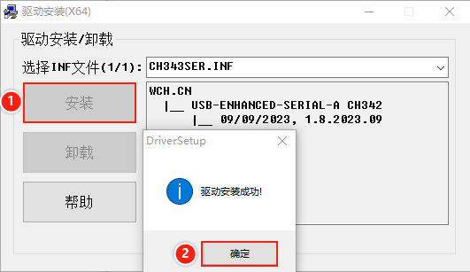
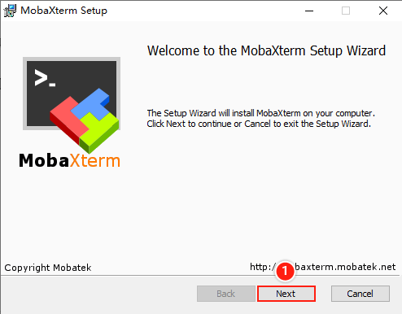
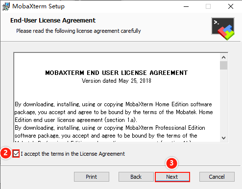
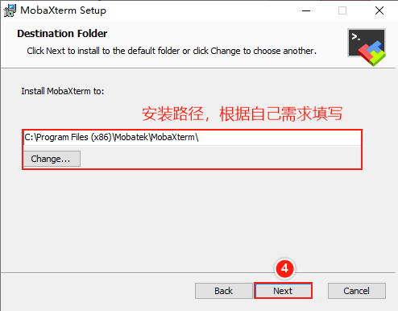
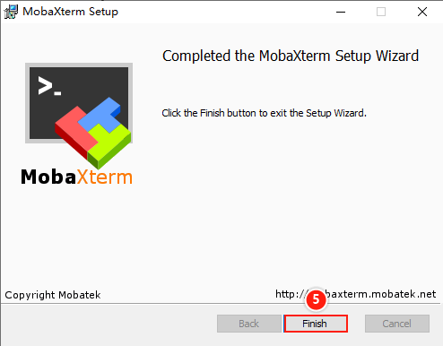

# 2.2 串口软件安装

&emsp;&emsp;小节前言：

&emsp;&emsp;这里简单地介绍CH342 USB串口驱动安装及MobaXterm终端的安装。 

&emsp;&emsp;安装CH342 USB串口驱动（电脑要与开发板进行串口通信，我们需要安装此驱动）

&emsp;&emsp;在【正点原子】STM32MP257开发板（A盘）-基础资料\03、软件文件夹下找到CH343SER.EXE（此驱动由沁恒提供，兼容CH342），双击运行，然后弹出的窗口，直接点击安装，等待安装成功窗口出现即可。

 
图 2.2 1 安装串口驱动

&emsp;&emsp;安装MobaXterm终端软件（或安装Xshell，SecureCRT等终端软件）
以MobaXterm为例。网盘路径【正点原子】STM32MP257开发板（A盘）-基础资料\3、软件\MobaXterm_Installer_v12.3.zip。双击打开这个压缩包，等待解压后，直接双击MobaXterm_installer_12.3.msi安装即可。MobaXterm安装程序将会引导您安装。

 
图 2.2 2 开始安装

 
图 2.2 3 勾选已读协议

 
图 2.2 4 选择安装路径

 
图 2.2 5 安装完成

