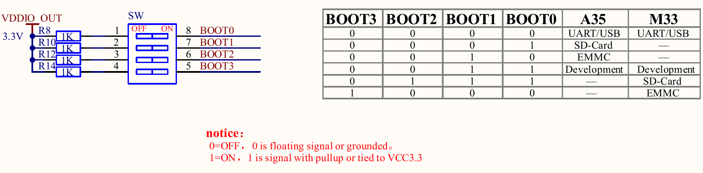
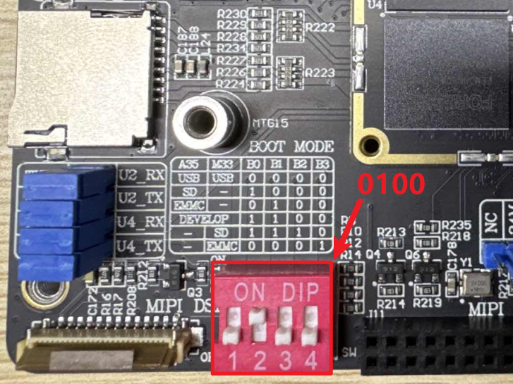
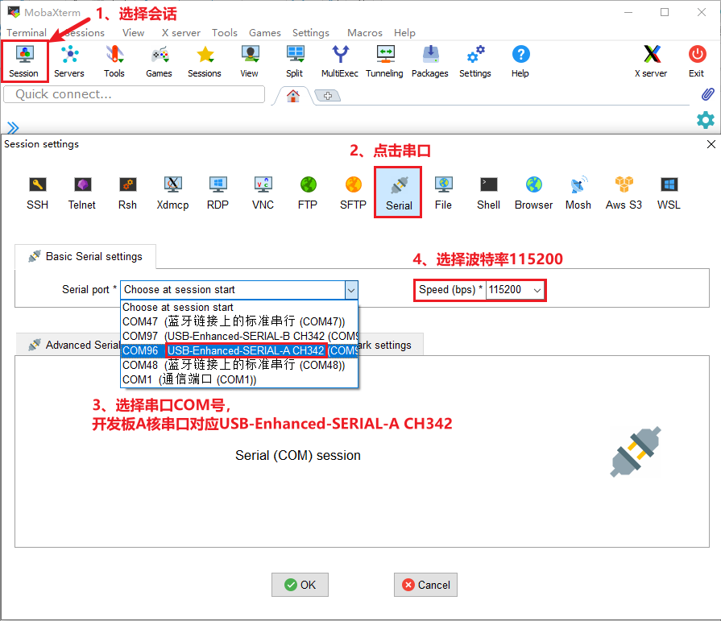
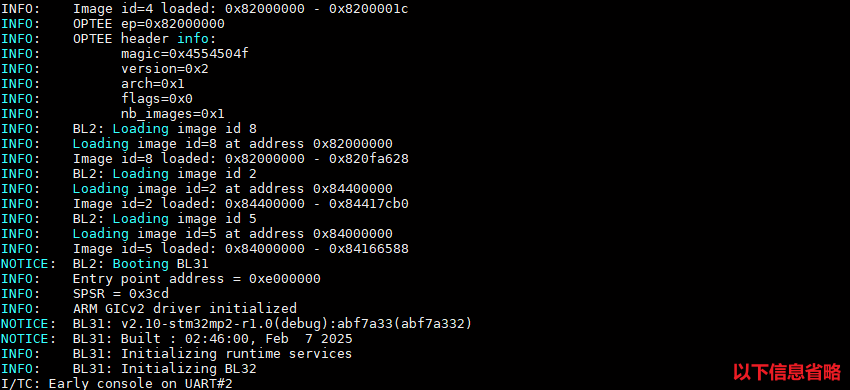
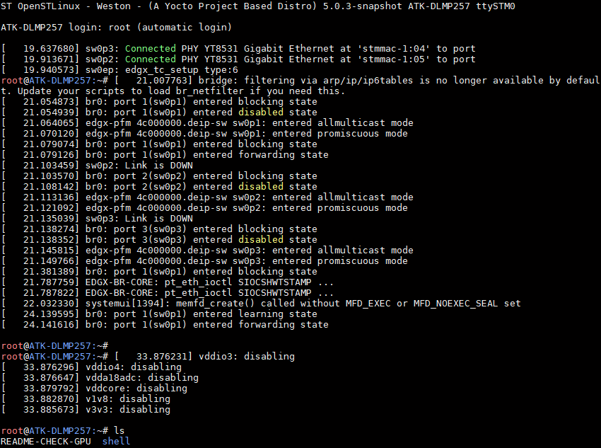

# 2.3 拨码开关设置及登陆开发板

&emsp;&emsp;ATK-DLMP257B开发板的拨码开关支持以下启动模式，下图是开发板底板BOOT原理图。

 
图 2.3 1 BOOT启动模式

&emsp;&emsp;STM32MP257处理器支持多种启动方式，支持从EMMC、SD卡、USB模式启动，还支持Development调试模式。本电路中，使用核心板引出的VDDIO_OUT电源（3.3V）对四个BOOT引脚进行上拉，当指定拨码拨至ON选项时，即连通拨码开关两侧电位，此时对应BOOT引脚为高电平，即配置为“1”，否则为“0”。根据不同BOOT引脚的“1”或“0”配置，实现启动模式的切换。底板支持的模式为以下配置：

| **BOOT3** | **BOOT2** | **BOOT1** | **BOOT0** | **启动核**       | **启动模式**     |
| --------- | --------- | --------- | --------- | ---------------- | ---------------- |
| 0         | 0         | 0         | 0         | Cortex-A35       | USB启动          |
| 0         | 0         | 0         | 1         | Cortex-A35       | SD卡启动         |
| 0         | 0         | 1         | 0         | Cortex-A35       | EMMC启动         |
| 0         | 0         | 1         | 1         | Development boot | Development boot |
| 0         | 0         | 0         | 0         | Cortex-M33       | USB启动          |
| 0         | 1         | 1         | 1         | Cortex-M33       | SD卡启动         |
| 1         | 0         | 0         | 0         | Cortex-M33       | EMMC启动         |

&emsp;&emsp;注意BOOT引脚序号排序，不要拨反顺序。

&emsp;&emsp;当核心板STM32MP257处理器处于USB启动模式时，为烧写模式，可进行系统镜像重新烧写，根据软件配置来选择烧写进EMMC存储芯片或者SD卡；当处理器处于EMMC启动模式时，处理器会读取存储在EMMC芯片里的系统镜像固件来启动运行；当处理器处于SD卡启动模式时，处理器会读取存储在SD卡里的系统镜像固件进行启动运行；当核心板处理器处于Development启动模式时，处理器会进入调试状态。

&emsp;&emsp;ATK-DLMP257B开发板使用一根USB Type-C连接线，连接底板上的UART接口，出厂时已经把Linux系统烧写到核心板上的eMMC存储上了。所以我们将拨码拨至0100（BOOT0~BOOT3），如下图，拨码向上表示为“1”（ON），向下表示为“0”(OFF)。

 
图 2.3 2 eMMC启动拨码方式

&emsp;&emsp;开发板插上DC12V直流电源，MobaXterm选择为串口类型，按如下设置。请选择相应的COM口（COM口是PC（电脑）识别开发板UART的串口号。如果此时开着虚拟机，请注意串口是否在等待选择连接或者已连接到虚拟机上，需要将串口切换连接到Windows端）。开发板使用CH342芯片将一路串口分为两路：

&emsp;&emsp;A核串口使用USB-Enhanced-SERIAL-A-CH342，

&emsp;&emsp;M核串口使用USB-Enhanced-SERIAL-B-CH342。

&emsp;&emsp;这里我们讲解使用基于A核启动的出厂系统，因此串口选择USB-Enhanced-SERIAL-A-CH342。

 
图 2.3 3 MobaXterm串口设置

&emsp;&emsp;开发板从eMMC模式启动后，串口终端打印系统的运行信息，我们可以启动开发板(开发板已启动的话可以重启开发板)，观察到串口打印如下。

 
图 2.3 4 串口打印的系统运行信息

&emsp;&emsp;出厂文件系统由yocto构建而成，在启动完开发板后，Qt界面也会跟着启动。

&emsp;&emsp;默认不需要输入登录账户密码，直接进入到系统根目录。登录后串口终端如下图。

 
图 2.3 5 串口终端打印登录开发板的信息

&emsp;&emsp;注意：出厂文件系统默认支持SSH服务，当用户使用SSH登录时，需要输入账户为root，密码root。
