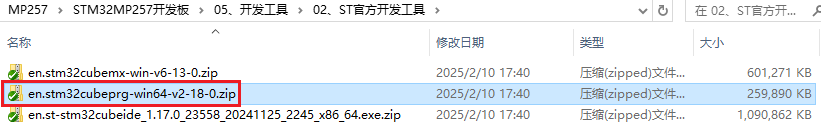

&emsp;&emsp;开发板或者核心板出厂发货前都会统一烧写出厂固件，上电就可以启动系统。

&emsp;&emsp;如果需要重新烧写出厂固件，可以在正点原子资料下载中心下载最新的出厂系统固件，使用UUU烧写工具烧写到开发板或核心板。

# 3.1 STM32CubeProgrammer简介

&emsp;&emsp;STM32CubeProgrammer 简称 STM32CubeProg，是一个适用于 STM32 系列产品的跨平台、多合一的程序烧写工具。正点原子ATK-DLMP257B开发板可采用该工具来进行系统烧写。

&emsp;&emsp;如下特点：

&emsp;&emsp;（1）“跨平台”，体现在支持 Windows、macOS 和 Linux 操作系统，软件运行时需要 Java 环境。

&emsp;&emsp;（2）“多合一”，体现在支持通过USB、ST-LINK、UART、OTA多种方式来烧写固件。

&emsp;&emsp;为方便用户使用，我们已从ST官网下载好STM32CubeProgrammer工具，存放路径为【正点原子】STM32MP257开发板（A盘）-基础资料\05、开发工具\02、ST官方开发工具。下面讲STM32CubeProgrammer安装及使用。

 
图 3.1 1 ST官方开发工具

