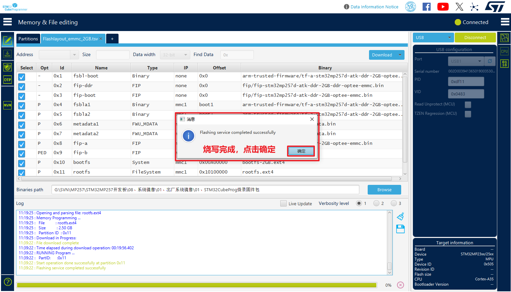

# 3.2 Windows下烧写系统到开发板

## 3.2.1 Windows安装STM32CubeProgrammer

&emsp;&emsp;解压en.stm32cubeprg-win64-v2-18-0.zip安装包，双击SetupSTM32CubeProgrammer_win64.exe进行安装。

&emsp;&emsp;弹出的欢迎安装界面，直接点击下一步；（此后的操作基本都是点击下一步即可）

 
图 3.2 1 STM32CubeProgrammer欢迎安装界面

&emsp;&emsp;阅读STM32CubeProgrammer的信息，直接点下一步；

 
图 3.2 2 阅读相关信息

&emsp;&emsp;勾选同意license，点击下一步：

 
图 3.2 3 同意条款，点下一步

&emsp;&emsp;请选择要安装的路径，可自行修改安装路径，点下一步：

 
图 3.2 4 选择安装路径，点下一步

&emsp;&emsp;已读条款，点下一步：

 
图 3.2 5 已读条款，点下一步

&emsp;&emsp;勾选需要安装选项，我们直接默认即可，点下一步：

 
图 3.2 6 默认安装选项，点下一步

&emsp;&emsp;正在安装：

 
图 3.2 7 正在安装

&emsp;&emsp;安装期间会弹出是否要安装一些驱动，我们选择始终安装此驱动程序。

&emsp;&emsp;弹出驱动安装界面，点击下一步：

 
图 3.2 8 点击下一步，安装此驱动

&emsp;&emsp;设备驱动安装完成，点击完成：

 
图 3.2 9 驱动安装完成

&emsp;&emsp;安装完成后，点击下一步：

 
图 3.2 10 STM32CubeProgrammer安装完成状态

&emsp;&emsp;默认会生成桌面快捷方式，点击下一步：

 
图 3.2 11 点击下一步，生成STM32CubeProgrammer快捷方式

&emsp;&emsp;点击Done，完成安装。

 
图 3.2 12 安装完成

&emsp;&emsp;桌面生成快捷方式如下。

 
图 3.2 13 生成的桌面快捷方式

&emsp;&emsp;双击STM32CubeProgrammer快捷方式打开出现如下界面，说明安装完成，软件运行正常。第一次使用时能会有一个help提示，我们点击ok即可。

 
图 3.2 14 STM32CubeProgrammer启动后的界面

## 3.2.2 Windows使用STM32CubePro烧写系统到eMMC

&emsp;&emsp;ATK-DLMP257B开发板插上电源，拨码开关选择为000（USB模式），将一根USB Type-C数据线连接到底板USB_OTG，再连接到PC（电脑）的USB 3.0接口（一般是内部是蓝色的就是USB 3.0接口，不要连接到USB 2.0接口，否则烧写很慢！经过实测，如果烧写时间很长，说明您的USB 3.0接口可能不是真正的USB 3.0接口，实质是USB 2.0）。另一根USB Type-C数据线连接到底板UART（串口非必需连接，目的是观察一些打印信息）。然后开发板上电。

&emsp;&emsp;双击STM32CubeProgrammer桌面图标打开STM32CubeProgrammer界面。按如下步骤，选择设备类型为USB，点击刷新设备，刷新不出来可以重新上电（注意不要将此USB设备连接到Ubuntu虚拟机上去了）。如下图，出现USB1表明成功！

 
图 3.2 15 开发板接OTG，拨码设置USB启动，启动开发板

 
图 3.2 16 识别出USB

&emsp;&emsp;按下图步骤，打开烧写到eMMC的tsv配置文件，网盘路径为【正点原子】STM32MP257开发板（A盘）-基础资料\08、系统镜像\01、出厂系统镜像\01、STM32CubeProg烧录固件包\flashlayout-image\optee，STM32CubeProgrammer会读取此配置文件将系统烧写到eMMC。

&emsp;&emsp;这里需要根据核心板DDR配置和烧写存储类型选择对应的tsv文件，这里笔者使用的是2GB版本的核心板，烧写出厂系统到emmc上，所以选择Flashlayout_emmc_2GB.tsv。1GB版本的核心板请选择Flashlayout_emmc_1GB.tsv。

 
图 3.2 17 选择烧写到eMMC的配置文件

&emsp;&emsp;浏览烧写系统所在目录，路径为08、系统镜像\01、出厂系统镜像\01、STM32CubeProg烧录固件包。（用户经常定位错目录，请注意不要选错自己的固件路径）

 
图 3.2 18 浏览烧写系统所在目录

&emsp;&emsp;确认连接信息，直接点击Download（下载）。

 
图 3.2 19 点击下载，开始烧写

&emsp;&emsp;正在烧写中，烧写过程中会重连接开发板，注意，如果您正在使用Ubuntu虚拟机，不要让开发板连接到Ubuntu虚拟机上去了。

 
图 3.2 20 正在烧写

&emsp;&emsp;烧写过程使用PC（电脑）USB3.0接口，烧写速度较快，约几分钟就可以烧写好整个系统。如果用户电脑没有USB 3.0接口，使用USB 2.0会相当慢（可能几十分钟）。

&emsp;&emsp;这里提示一点，当需要多次烧写系统时，如果用户不想更新板子文件系统，我们可以编辑tsv文件，将烧写文件系统的配置信息即最后一行，将“P”修改为“PE”，即代表跳过，不烧写。

 
图 3.2 21 可跳过文件系统烧写

&emsp;&emsp;烧写完成如下图。

 
图 3.2 22 烧写完成

&emsp;&emsp;烧写完成后，开发板拨码到0100，eMMC启动即可。

 
图 3.2 23 EMMC模式启动

## 3.2.3 Windows使用STM32CubePro烧写系统到TF (SD)卡

&emsp;&emsp;请参考上面3.2.2小节烧写到eMMC的方法，选择烧写到TF卡的Flashlayout_sd_2GB.tsv配置文件即可，如果是1GB版本的核心板需要选择Flashlayout_sd_1GB.tsv。需要提前把TF卡接入开发板，开发板再连接USB_OTG烧写。

&emsp;&emsp;烧写完成后，拨码到1000，SD卡（TF卡）启动即可。

