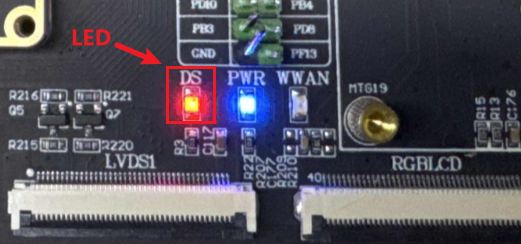

# 4.1 LED测试

&emsp;&emsp;ATK-DLMP257B开发板上配有一个用户LED灯，默认在uboot阶段配置为常亮，在内核启动之后闪烁。

&emsp;&emsp;在文件系统输入如下指令，可以控制LED的状态。

```c#
cat /sys/class/leds/red:heartbeat/trigger		 //查看LED 的当前触发方式及支持的触发方式
echo none > /sys/class/leds/red:heartbeat/trigger 		//改变LED 的触发方式，设置为none
echo 1 > /sys/class/leds/red:heartbeat/brightness 	 	//点亮LED
echo 0 > /sys/class/leds/red:heartbeat/brightness 	 	//熄灭LED
echo heartbeat > /sys/class/leds/red:heartbeat/trigger  //LED 的触发方式设置为心跳heartbeat
```

<center>
<br />
图 4.1 1开发板LED位置
</center>


