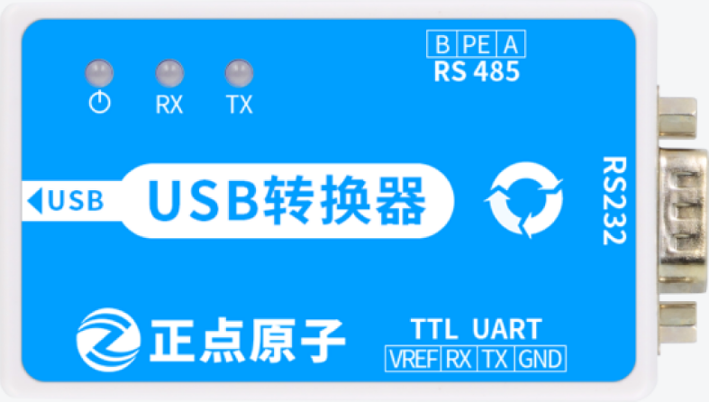
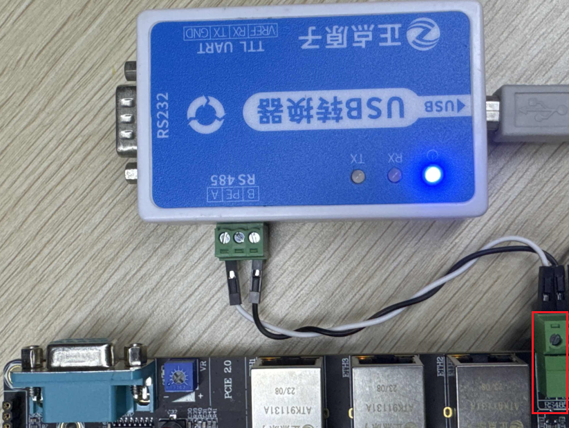
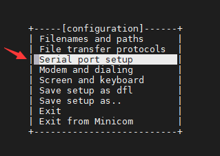
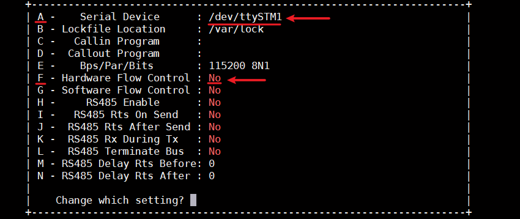
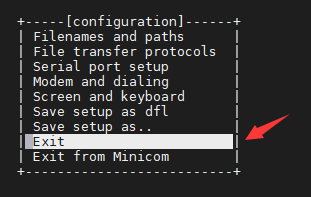
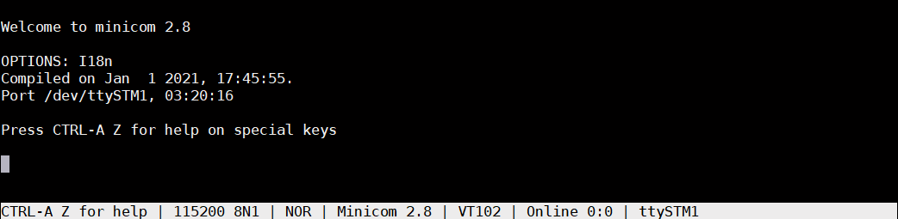
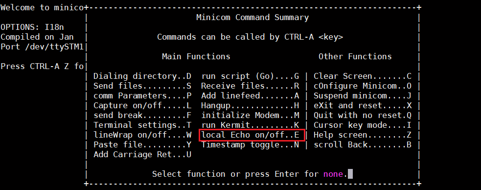
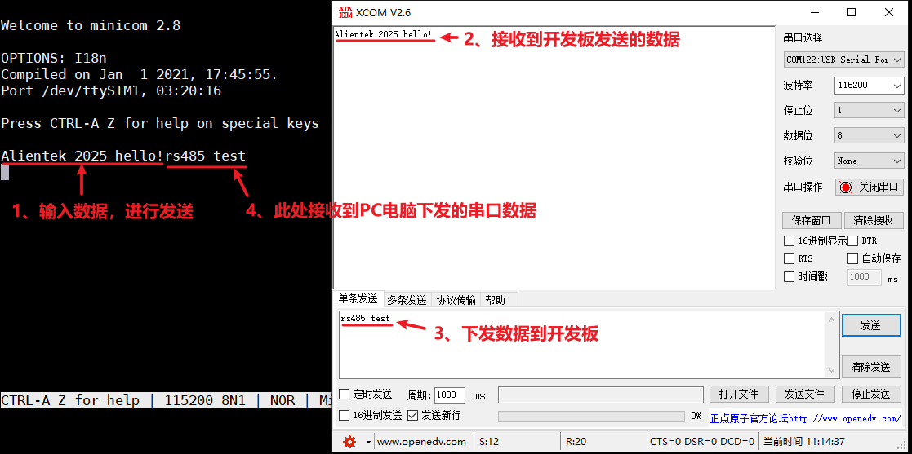
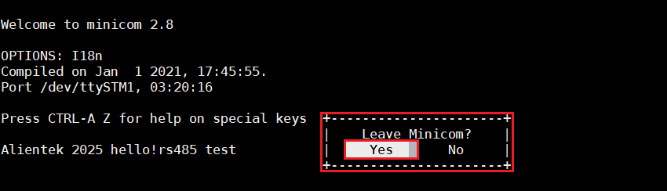

# 4.10 RS485串口测试

&emsp;&emsp;ATK-DLMP257B开发板板载1路RS485，测试前需要准备正点原子USB转换器来完成测试，如下图所示：

<center>
<br />
图 4.10 1 正点原子多合一USB 转换器模块
</center>

&emsp;&emsp;将开发板的RS485 A端通过杜邦线连接到正点原子USB转换器模块的RS485 A端，B端连接到B端。使用了正点原子的USB转换器模块，会在PC(电脑端)看到一个串口。

<center>
<br />
图 4.10 2 RS485接口连接
</center>

&emsp;&emsp;在计算机的设备管理器查看端口号。编者的端口号有三个，两个是开发板 USB 调试串口的，另一个就是RS485的端口号了。

<center>
<br />
图 4.10 3 设备管理器查看端口号
</center>

&emsp;&emsp;可以看到USB-SERIAL Port(COM122)为开发板底板的RS485串口。下面使用minicom串口调试工具来进行数据收发测试。

&emsp;&emsp;执行下面命令进入minicom配置界面（这里不详细讲minicom使用方法）

```c#
minicom -s
```

<center>
<br />
图 4.10 4 minicom配置界面
</center>

&emsp;&emsp;进入minicom配置界面，通过键盘“↓”方向键选择第3项“Serial port setup”来配置RS485串口。

<center>
<br />
图 4.10 5 minicom配置界面
</center>

&emsp;&emsp;在出厂系统中，RS485串口对应的设备为/dev/ttySTM1，所以我们下面配置为/dev/ttySTM1，115200，8N1，无硬件流控。

&emsp;&emsp;操作方式为，在下面界面按“A”键即可修改“Serial Device”选项内容，我们改为“/dev/ttySTM1”，按Enter确认；再按“F”键即可关闭硬件流控功能，即将默认的“Yes”改为“No”。按“E”键可调整波特率，但它默认为“115200 8N1”，所以我们不用调整。

<center>
<br />
图 4.10 6 RS485串口配置
</center>

&emsp;&emsp;最后按Enter确认最终配置，即退出当前配置界面。以下界面选择“Exit”退出配置界面，即可进入数据收发窗口。

<center>
<br />
图 4.10 7 退出配置界面
</center>

<center>
<br />
图 4.10 8 进入数据收发窗口
</center>

&emsp;&emsp;在进行数据收发之前，先打开minicom数据回显功能，显示将要发送的数据和接收的数据。按Ctrl+A，再按“Z”即可打开minicom命令界面，按“E”键打开回显功能，返回数据收发窗口，即可通过RS485串口和PC电脑端口进行数据收发。

<center>
<br />
图 4.10 9 按“E”打开回显功能
</center>

&emsp;&emsp;电脑端使用XCOM软件打开USB-SERIAL Port(COM112)串口，波特率115200，8N1，即可通过RS485串口和开发板进行数据收发。

<center>
<br />
图 4.10 10 RS485收发
</center>

&emsp;&emsp;测试完成后，按Ctrl+A，再按“Z”打开minicom命令界面，按“X”键退出minicom工具，按Enter键确认退出，完成测试过程。

<center>
<br />
图 4.10 11 退出minicom测试
</center>


