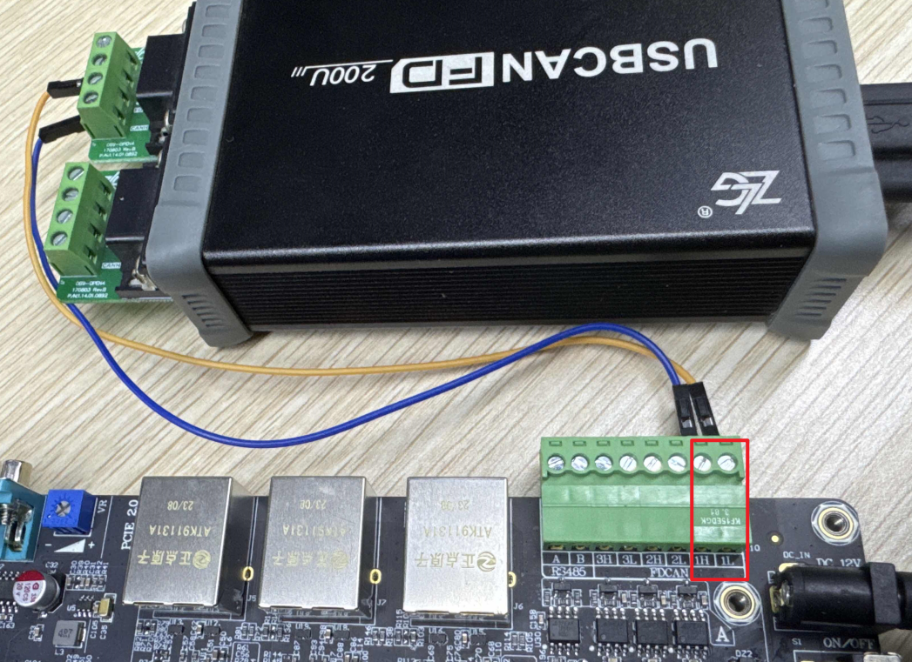
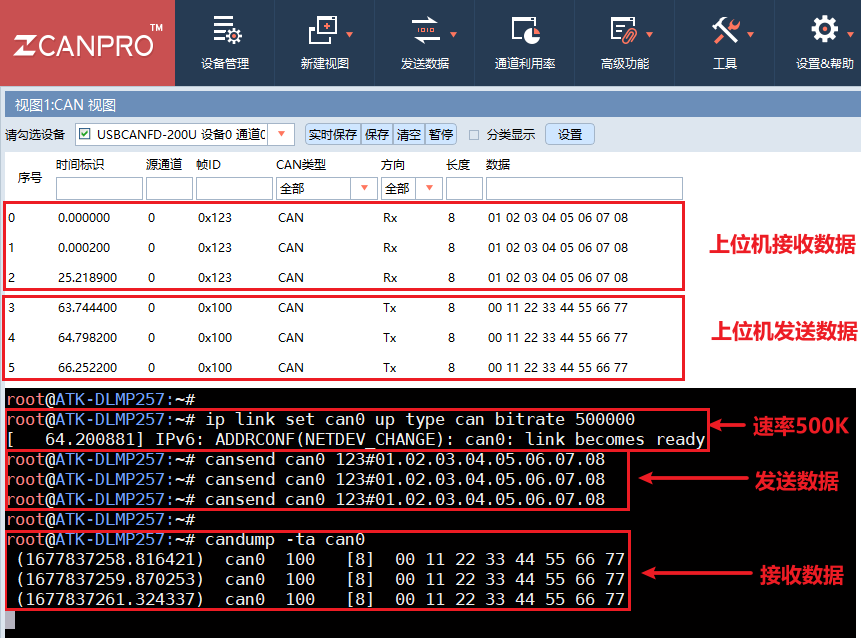

# 4.11 CAN测试

&emsp;&emsp;ATK-DLMP257B开发板板载三路CAN（均支持CAN FD）。在测试CAN 之前，需要准备好测试CAN 的仪器，比如致远电子的CAN 分析仪、创芯科技的CAN 分析仪和广成科技的CAN 分析仪等，否则只能用两块不同开发板的CAN 或者其他CAN 设备测试。关于CAN 仪器及CAN上位机的使用，请参照各厂商产品的使用说明书。

&emsp;&emsp;开发板所使用的CAN 的主要特性如下：
- 支持CAN FD，可以理解成CAN 协议的升级版，只升级了协议，物理层未改变。<br />
-	CAN与CAN FD主要区别：传输速率不同、数据长度不同、帧格式不同、ID长度不同。<br />
-	数据比特率最高5Mbps。

&emsp;&emsp;测试前请将CAN 分析仪或者测试CAN 的设备连接到ATK-DLMP257B开发板的CAN 接口，CANH 端连接CAN 仪器的CANH，CANL 端连接CAN 仪器的CANL。

&emsp;&emsp;下面举例使用FDCAN1 接口来进行CAN 功能测试，FDCAN2和FDCAN3同理。开发板CAN1 接口和CAN分析仪连接方式如下图所示。

<center>
<br />
图 4.11 1 CAN接口和接线
</center>

&emsp;&emsp;系统中对应的CAN设备如下：

<div class="stm32mp257_center-table-div">
<table class="stm32mp257_center-table">
  <tr>
    <th>外设接口</th>
    <th>系统接口</th>
  </tr>
  <tr>
    <td>CAN1</td>
    <td>can0</td>
  </tr>
  <tr>
    <td>CAN2</td>
    <td>can1</td>
  </tr>
  <tr>
    <td>CAN3</td>
    <td>can2</td>
  </tr>
</table>
</div>

## 4.11.1 CAN测试

&emsp;&emsp;CAN 最低数据比特率10kBit/s，最高数据比特率1000kBit/s。

&emsp;&emsp;测试前提示一下，下面示例指令，是基于FDCAN1 接口测试，对应系统设备名称为can0。

&emsp;&emsp;若用户需要测试FDCAN2 接口，则对应系统设备名称为can1；若用户需要测试FDCAN3 接口，则对应系统设备名称为can2注意修改指令即可。

&emsp;&emsp;示例FDCAN1 接口，配置can0 数据比特率为500kBit/s。

```c#
ip link set can0 up type can bitrate 500000
```

&emsp;&emsp;使用cansend 指令发送数据。

```c#
cansend can0 123#01.02.03.04.05.06.07.08
```

&emsp;&emsp;解释：<br />
&emsp;&emsp;（1）can0：can0 表示FDCAN1 接口设备，can1 表示FDCAN2 接口设备，can2 表示FDCAN3 接口设备。<br />
&emsp;&emsp;（2）123：帧ID<br />
&emsp;&emsp;（3）01.02.03.04.05.06.07.08：帧数据

&emsp;&emsp;使用candump 指令接收数据。按Ctrl+c 终止指令。

```c#
candump -ta can0
```

&emsp;&emsp;解释：<br />
&emsp;&emsp;（1）-ta: t 代表打印时间，a 代表开启ASCII 输出。

&emsp;&emsp;下面使用CAN 分析仪，设置CAN 的速率为500000，测试结果如下图。

<center>
<br />
图 4.11 2 使用上位机与开发板进行CAN 收发通信
</center>


