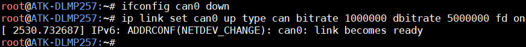
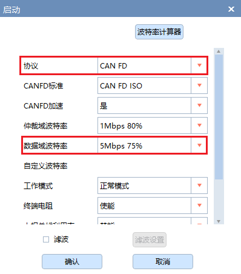
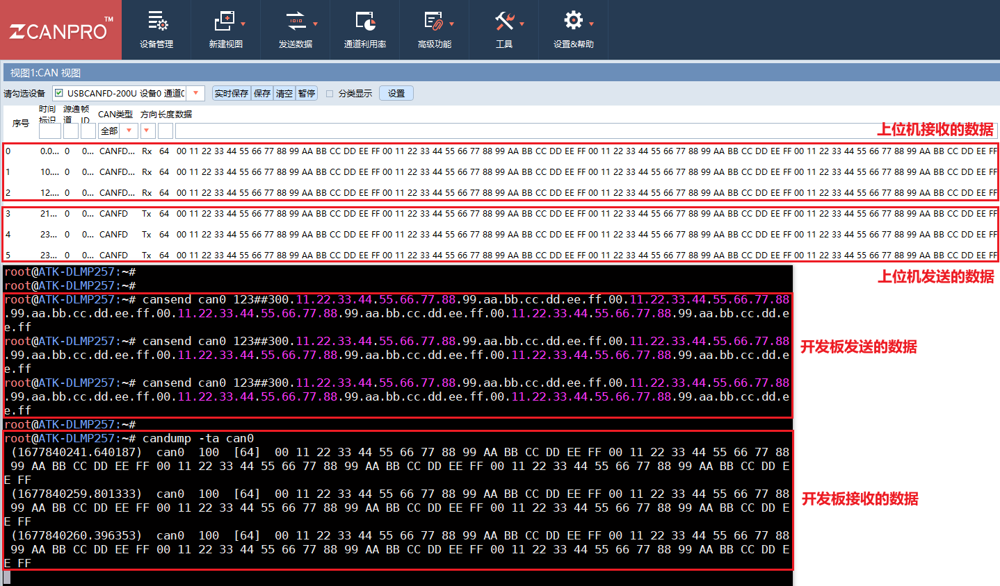

# 4.12 CAN FD测试

&emsp;&emsp;下面采用CAN 测试设备（支持CAN FD），进行CAN FD 测试。如果CAN 测试设备不支持CAN FD 功能，则不能用于测试CAN FD。

&emsp;&emsp;开发板的CAN FD 波特率最高为1000 kBit/s，数据波特率为5000 kBit/s。可用的速率如下，如需要使用更低的波特率，请使用CAN，而非CAN FD。

&emsp;&emsp;测试前提示一下，下面示例指令，是基于FDCAN1 接口测试，对应系统设备名称为can0。若用户需要测试CAN2 接口，则对应系统设备名称为can1，注意修改指令即可。

&emsp;&emsp;设置不同速率时，需要先关闭CAN 设备，再设置CAN 的速率，如果设置不成功，请重启板子或者上位机软件。

```c#
ifconfig can0 down
```

&emsp;&emsp;这里提供配置CAN FD 的速率示例。

```c#
ip link set can0 up type can bitrate 1000000 dbitrate 5000000 fd on
```

&emsp;&emsp;此处设置波特率为1000 kBit/s，数据波特率为5000 kBit/s 进行测试。


<center>
<br />
图 4.12 1开发板设置CAN FD 速率
</center>

&emsp;&emsp;CAN测试设备上位机也设置CANFD模式：

<center>
<br />
图 4.12 2 上位机配置
</center>

&emsp;&emsp;使用cansend 命令发送数据，下面为一行完整指令，请分行复制并组合！

```c#
cansend can0 123##300.11.22.33.44.55.66.77.88.99.aa.bb.cc.dd.ee.ff.00.11.22.33.44.55.66.77.88.99.aa.bb.cc.dd.ee.ff.00.11.22.33.44.55.66.77.88.99.aa.bb.cc.dd.ee.ff.00.11.22.33.44.55.66.77.88.99.aa.bb.cc.dd.ee.ff
```

&emsp;&emsp;解释：<br />
&emsp;&emsp;（1）can0: can0 表示FDCAN1 接口设备，can1 表示FDCAN2 接口设备。<br />
&emsp;&emsp;（2）123: 帧ID<br />
&emsp;&emsp;（3）3：标志（flags）<br />
&emsp;&emsp;（4）00.11.22…: 帧数据

&emsp;&emsp;使用candump 指令接收数据。按Ctrl+c 终止指令。

```c#
candump -ta can0
```

&emsp;&emsp;解释：<br />
&emsp;&emsp;（1）-ta: t 代表打印时间，a 代表开启ASCII 输出

&emsp;&emsp;开发板CAN FD 测试结果如下图。

<center>
<br />
图 4.12 3 使用上位机与开发板进行CAN FD 收发通信
</center>
