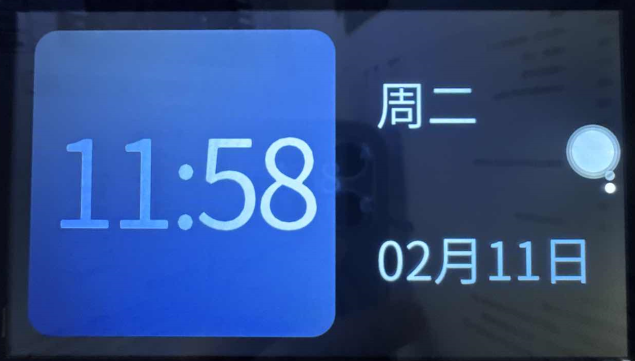

# 4.14 RTC时钟测试

&emsp;&emsp;ATK-DLMP257开发板有两个硬件时钟，一个是核心板上的处理器内部的RTC时钟（/sys/class/rtc/rtc0）。另外一个是底板上RTC时钟芯片AT8563，属于芯片外部RTC时钟（/sys/class/rtc/rtc1），由RTC纽扣电池供电，开发板掉电仍保存时间和计时。若需要提高时钟的精度，需要用高精度的晶振。

&emsp;&emsp;请检查开发板底板上是否有安装RTC纽扣电池。也可以用万用表检查RTC电池有没有电，测出来是3.3v左右才是正常的。防止因RTC电池没电不能保存时间。（注意，电池属于易耗品，若没电请更换纽扣电池）

&emsp;&emsp;Linux系统分两个时钟，一个是system time（软件时钟），一个是hardware clock（硬件时钟）。使用date和hwclock命令可分别查看和设定系统时间和硬件时间。系统时钟掉电即会消失，RTC 时钟在有电池的情况下会长期运行。系统时钟会在系统重启时与 RTC 时钟同步。

## 4.14.1 RTC0(内部RTC时钟)修改测试

&emsp;&emsp;QT界面的时间和内核默认的指定时钟都是使用的rtc0。

&emsp;&emsp;先关闭deptp服务，再设置时间进行测试；

```c#
systemctl stop deptp.service
date
```

&emsp;&emsp;给内部rtc写入时间：

```c#
date -s "2025-02-11 11:58:00"
hwclock --systohc --rtc=/dev/rtc0 --localtime
```

&emsp;&emsp;查询内部rtc时间：

```c#
cat /sys/class/rtc/rtc0/time
cat /sys/class/rtc/rtc0/date
date
```

&emsp;&emsp;此时查看Qt界面可以看到Qt界面的时间修改了。

<center>
<br />
图 4.14 1 Qt界面上的时间
</center>

&emsp;&emsp;如果需要启动deptp服务请执行下面指令：

```c#
systemctl start deptp.service
```

## 4.14.2 RTC1(外部时钟模块AT8563)修改测试

&emsp;&emsp;先关闭TSN服务，再设置时间进行测试；

```c#
systemctl stop deptp.service
date
```

&emsp;&emsp;给AT8563写入时间：

```c#
date -s "2025-02-11 11:58:00"
hwclock --systohc --rtc=/dev/rtc1 --localtime
```

&emsp;&emsp;查询PCF8563时间：

```c#
cat /sys/class/rtc/rtc1/time
cat /sys/class/rtc/rtc1/date
date
```

&emsp;&emsp;如果需要启动deptp服务请执行下面指令：

```c#
systemctl start deptp.service
```


