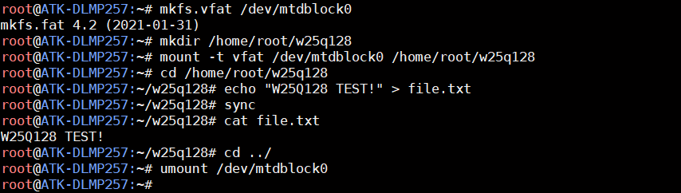

# 4.16 SPI FLASH测试

&emsp;&emsp;ATK-DLMP257B开发板板载SPI NOR FLASH 芯片，型号为W25Q128，它通过SPI 总线进行读写访问，具备16MB 存储空间。

&emsp;&emsp;内核启动时会自动加载W25Q128 驱动，芯片正常工作时，内核会驱动加载信息。出厂系统将SPI Flash 注册成MTD 设备，因此我们可以通过MTD 子系统对其进行文件读写操作。

```c#
ls /dev/mtd*
```

<center>
<br />
图 4.16 1查看mtd 设备
</center>

&emsp;&emsp;文件读写测试步骤如下：

&emsp;&emsp;0、首次使用，需要格式化一遍/dev/mtdblock0 分区。注意，如果不是首次使用，请不用执行格式化指令，否则之前执行过的写入文件数据将被清除，需要重新写入；

```c#
mkfs.vfat /dev/mtdblock0
```

&emsp;&emsp;1、创建自定义挂载目录，并将/dev/mtdblock0 分区以VFAT 格式挂载到此目录；

```c#
mkdir /home/root/w25q128
mount -t vfat /dev/mtdblock0 /home/root/w25q128
```

&emsp;&emsp;2、进入挂载目录，进行写文件测试；

```c#
cd /home/root/w25q128
echo "W25Q128 TEST!" > file.txt
sync
```

&emsp;&emsp;3、读文件，确认是否写入成功；

```c#
cat file.txt
```

&emsp;&emsp;4、最后退出挂载目录，并取消/dev/mtdblock0 分区挂载；

```c#
cd ../
umount /dev/mtdblock0
```

&emsp;&emsp;此时，写入的文件数据已经存储在SPI FLASH 芯片中，可通过再次挂载目录或者重启板子后重新挂载，来进行文件的读写。

<center>
<br />
图 4.16 2 SPI FLASH 读写文件测试过程
</center>


