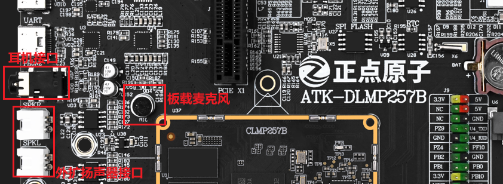
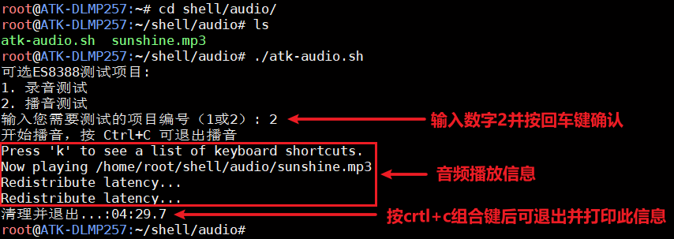

# 4.17 音频测试

&emsp;&emsp;ATK-DLMP257B开发板板载一颗高性能音频编解码芯片ES8388。板载麦克风可录音，底
板背面接了一个小功率喇叭，方便用户进行音频测试。

<center>
<br />
图 4.17 1开发板正面音频部分
</center>

<center>
<br />
图 4.17 2 开发板背面音频部分
</center>


## 4.17.1 播放音频测试

&emsp;&emsp;开发板出厂系统里有音频配置和测试文件，按照如下指令执行音频测试脚本。

```c#
cd shell/audio
./atk_audio.sh
```

&emsp;&emsp;第一次运行该脚本时，会打印音频设备初始化相关操作，后续执行此脚本时不再打印初始化相关信息。按crtl+c组合键可以退出脚本。

&emsp;&emsp;初始化完音频设备后，输入数字2并确认即可播放音频测试，播放信息如下。期间板载扬声器会播放音频，如果使用的是耳机则也会在耳机端播放。


<center>
<br />
图 4.17 3音频播放测试
</center>

## 4.17.2 录音测试

&emsp;&emsp;开发板出厂系统里有音频配置和测试文件，按照如下指令执行音频测试脚本。

```c#
cd shell/audio
./atk_audio.sh
```

&emsp;&emsp;第一次运行该脚本时，会打印音频设备初始化相关操作，后续执行此脚本时不再打印初始化相关信息。按crtl+c组合键可以退出脚本。

&emsp;&emsp;初始化完音频设备后，输入数字1确认后，下一步选择麦克风测试项目，如果是使用带麦克风的耳机接在开发板PHONE接口则使用1. 耳机麦克风；如果是没接耳机，直接使用开发板自带的板载麦克风MIC，则使用2. 板载麦克风。这里笔者使用的是开发板自带的板载麦克风MIC，这里选择第二项。选择好对应的麦克风配置后，脚本会自动进行录音，请靠近麦克风进行录音测试。


<center>
<br />
图 4.17 4使用板载麦克风配置录音测试
</center>

&emsp;&emsp;录音完成后会在当前目录下生成record.wav文件，此文件就是笔者刚刚录音生成的音频文件，可以使用aplay再次播放录制好的音频文件。

```c#
aplay record.wav
```

<center>
<br />
图 4.17 5 aplay播放录制好的音频文件
</center>


