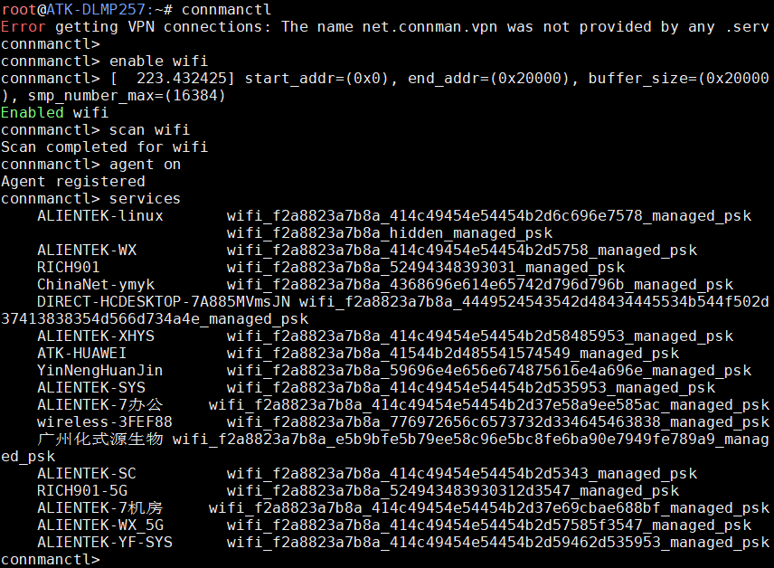
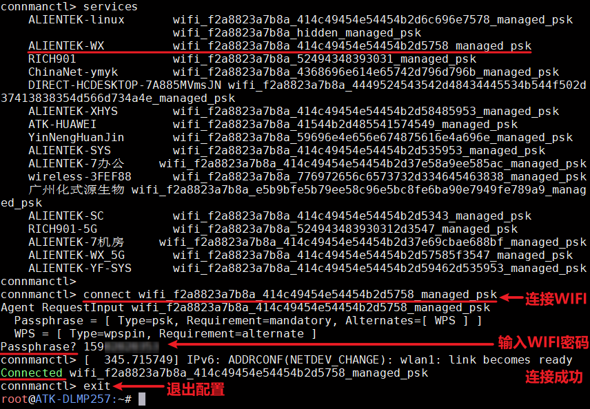
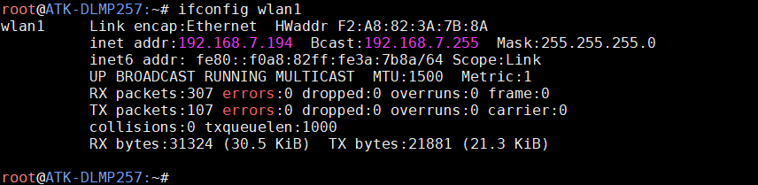
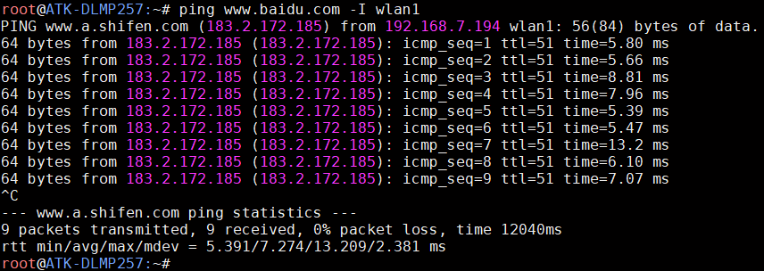

# 4.18 板载USB WIFI测试

&emsp;&emsp; ATK-DLMP257B开发板采用WIFI&蓝牙二合一模组，芯片为RTL8733BU。

&emsp;&emsp;进行WIFI测试之前，请确保开发板上安装好天线，否则无法扫描和连接WIFI。

&emsp;&emsp;进入文件系统后，输入下面命令进行WIFI 测试。

```c#
connmanctl
connmanctl> enable wifi
connmanctl> scan wifi
connmanctl> agent on
connmanctl> services
```

&emsp;&emsp;运行结果如下：


<center>
<br />
图 4.18 1扫描到的热点
</center>

&emsp;&emsp;从扫描到的WIFI 热点列表中，使用命令connect XXXX 进行连接，再输入密码按回车确认。比如示例要连接ALIENTEK-WX，运行结果如下：

<center>
<br />
图 4.18 2 连接热点
</center>

&emsp;&emsp;如上结果，已连接到WIFI 热点，可以用ifconfig 指令查看我们的wlan1所获取的ip地址。

<center>
<br />
图 4.18 3 查看获取到的ip 地址
</center>

&emsp;&emsp;ping 百度测试连通性，也可以ping 网关来测试WIFI 的连通性。

```c#
ping www.baidu.com -I wlan1
```

<center>
<br />
图 4.18 4 ping百度测试
</center>


