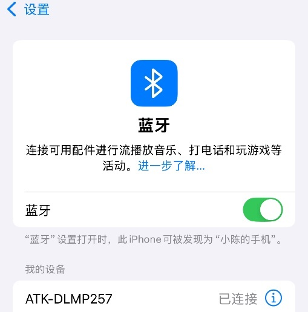

# 4.19 板载蓝牙测试

&emsp;&emsp;ATK-DLMP257B开发板采用WIFI&蓝牙二合一模组，芯片为RTL8733BU。

&emsp;&emsp;进行蓝牙测试之前，请确保开发板上安装好天线，否则无法扫描和连接蓝牙。

&emsp;&emsp;蓝牙配对需要用到bluetoothd 服务，bluetoothd 作为系统服务在后台运行，负责管理蓝牙适配器和处理蓝牙设备的连接、配对和通信。它是Linux 系统中与蓝牙相关的核心组件之一。bluetoothd 存放在/usr/libexec/bluetooth 目录下，默认系统运行时已开启，如果需要手动开启可以执行下面命令在后台开启服务。

```c#
/usr/libexec/bluetooth/bluetoothd -C &
```

&emsp;&emsp;输入下面指令，进入bluetoothctl 交互模式。

```c#
rfkill unblock bluetooth		#解锁蓝牙
hciconfig hci0 up			#使能蓝牙设备
bluetoothctl
```

&emsp;&emsp;依次执行下面指令。

```c#
power on 		#打开电源
agent on 			#开启代理
discoverable on 	#开启可被检测
scan on 			#开启扫描设备
devices			#当前已扫描搭到的设备
```

<center>
<br />
图 4.19 1 配置并运行蓝牙
</center>

&emsp;&emsp;如下图，笔者扫描到自己的手机蓝牙MAC 地址，确认后就可以进行配对了。不同手机系统可能对蓝牙有不同的拦截或者数据保护策略，请确保手机蓝牙不被拦截。

<center>
<br />
图 4.19 2扫描到蓝牙设备
</center>

&emsp;&emsp;当扫描到目标蓝牙设备后，执行scan off停止扫描。

&emsp;&emsp;输入下面指令进行配对，然后在手机蓝牙端找到ATK-DLMP257设备并点击连接。

```c#
pair XX:XX:XX:XX:XX:XX	     # 请填写你自己的蓝牙MAC
```

<center>
<br />
图 4.19 3 确认蓝牙匹配请求
</center>

&emsp;&emsp;同时，手机端也选择配对。

<center>
<br />
图 4.19 4 手机端蓝牙配对请求
</center>

&emsp;&emsp;匹配成功后，我们就可以在手机端手动连接开发板蓝牙了。

<center>
<br />
图 4.19 5 手机端连接开发板蓝牙
</center>

&emsp;&emsp;同理，开发板端也会提示蓝牙连接，输入yes确认连接。

<center>
<br />
图 4.19 6 开发板确认连接手机蓝牙
</center>

&emsp;&emsp;等到连接到自己的蓝牙设备，输入exit 退出交互模式。

```c#
exit
```

<center>
<br />
图 4.19 7退出蓝牙工具
</center>

&emsp;&emsp;使用l2ping工具测试蓝牙连接。此工具需要目标设备蓝牙支持L2CAP回显功能且开启相关的蓝牙权限，在适中距离（一般是十米内）且无明显物理障碍物和电磁干扰源，笔者使用的是iPhone，通信正常显示0 bytes，如果是安卓手机则是显示44 bytes。

```c#
l2ping XX:XX:XX:XX:XX:XX				# 请填写你自己的蓝牙MAC
```

<center>
<br />
图 4.19 8 蓝牙l2ping测试
</center>


