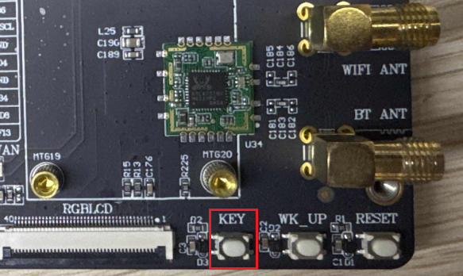
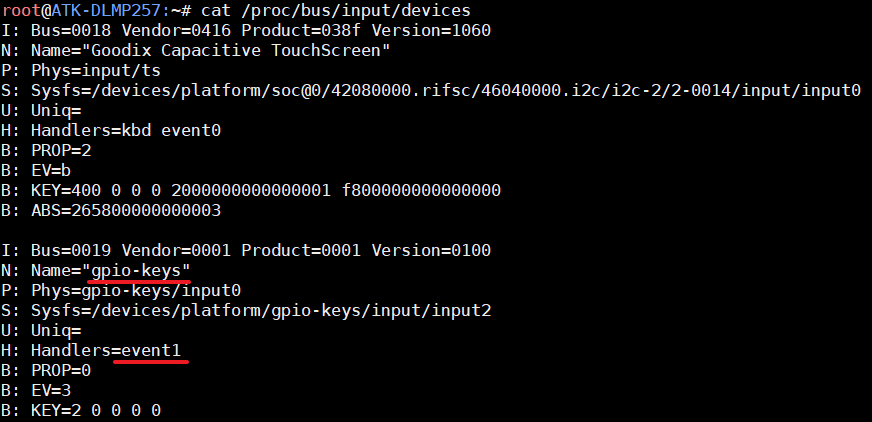
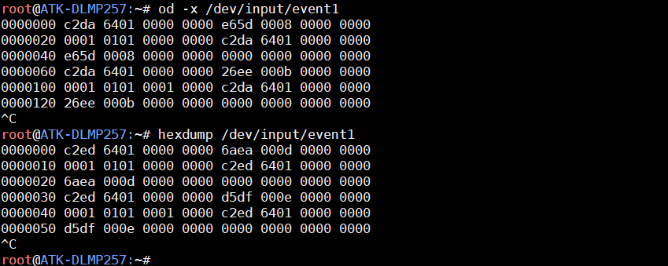

# 4.2 按键测试

&emsp;&emsp;ATK-DLMP257B开发板上配有一个用户按键KEY，按键位置如下图所示：


<center>
<br />
图 4.2 1 KEY按键位置
</center>

&emsp;&emsp;在出厂文件系统输入如下指令，查看输入事件对应的设备。

```c#
cat /proc/bus/input/devices
```

<center>
<br />
图 4.2 2按键事件
</center>

&emsp;&emsp;笔者在测试时，开发板接入了MIPI LCD屏幕。从上图我们可以知道，此时event0为触摸屏事件（例如GT系列触摸芯片），event1为按键KEY事件。如果用户没有接入触摸屏，则event0将是按键KEY事件。故event1不一定固定是按键事件，这与用户板卡上接入的设备情况相关。

&emsp;&emsp;如果接了屏幕，可以用od -x 或者hexdump 指令来查看按键输入信息。按Ctrl+c 终止指令。

```c#
od -x /dev/input/event1
或者：hexdump /dev/input/event1
```

&emsp;&emsp;如果用户没有接入LCD 屏幕，则测试按键的指令如下：

```c#
od -x /dev/input/event0
或者：hexdump /dev/input/event0
```

&emsp;&emsp;按下按键KEY 有如下信息出现，说明按键正常。如果没有反应，可以多按几次按键尝试。

<center>
<br />
图 4.2 3打印的按键事件
</center>


