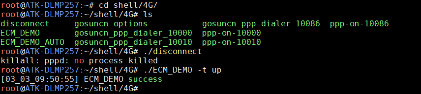
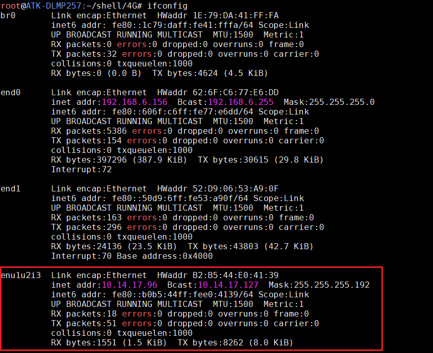
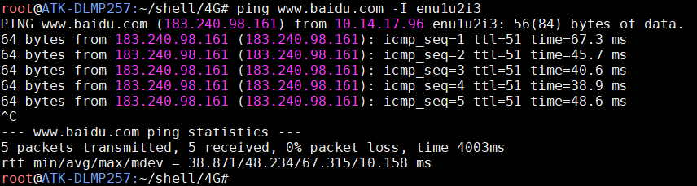
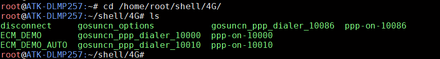
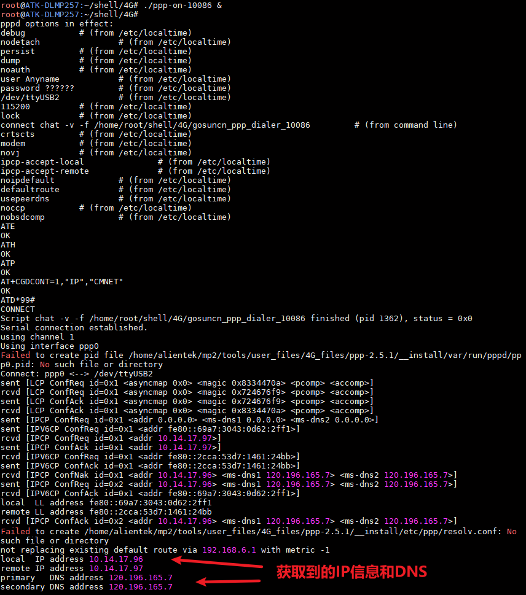
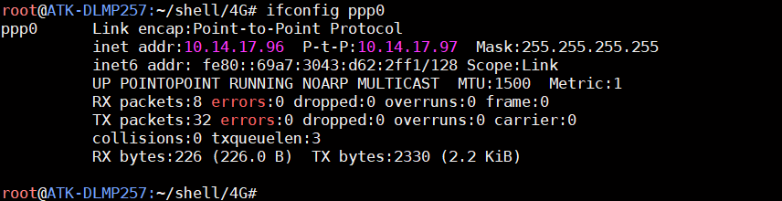
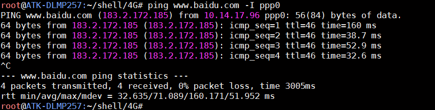

# 4.21 4G模块ME3630测试

&emsp;&emsp;ATK-DLMP257B开发板预留一个4G 模块接口（MINI PCIE接口），支持ME3630-W，EC20 等4G 模块的安装。准备ME3630-W 4G 模块，将ME3630-W 4G 模块插到4G 模块接口处，拧上螺丝。保证4G 模块与座子接口吻合连接。请使用原装天线，把天线连接到4G 模块的MAIN接口处。（温馨提示：4G 模块在开封使用后，金手指容易氧化，时间长了上面会有一层氧化膜，如果多次实验不成功，请检查4G模块是否插好，或者是否有氧化膜。使用后请保存好4G 模块！）

&emsp;&emsp;正确插入4G 卡（支持移动、联通、电信4G 卡）及插好模块，开发板启动后底板上的WWAN LED 会亮绿灯。如果WWAN LED 绿灯未亮起，请检查模块是否正确连接插入，4G 卡是否插
入，天线是否接好，开发板需插上配带的12V 电源。

&emsp;&emsp;4G 模块正常加载后，可以在/dev/下看到有3 个ttyUSB*生成。4G 模块通过AT 指令访/dev/ttyUSB2 进行通信。

```c#
ls /dev/ttyUSB*
```


<center>
<br />
图 4.21 1查看4G模块节点
</center>

## 4.21.1 ECM上网

&emsp;&emsp;在操作系统看来，CDC ECM 设备就是一个虚拟以太网卡，包含标准网卡需要的MAC 地址和IP 地址。

&emsp;&emsp;ECM_DEMO_AUTO 和ECM_DEMO 是高新兴ECM 上网的程序（我们不需要知道源码，因为它只是一个工具），详细的参数可以执行ECM_DEMO -h 查看。

&emsp;&emsp;ECM_DEMO_AUTO 和ECM_DEMO 参数是一样的，区别是ECM_DEMO 执行完流程就会退出，ECM_DEMO_AUTO 会一直运行并每隔一段时间会检查是否断网，断网了会自动重连。                   ECM_DEMO_AUTO 默认会自动执行拨号流程，故适合做开机自启的程序。

&emsp;&emsp;要配置ECM 模式上网，如果运行了pppd 上网，请先执行disconnect 脚本断开pppd 拨号上网，再执行下面的指令配置成ECM 模式连接网络。

```c#
cd shell/4G
./disconnect
./ECM_DEMO -t up
```

<center>
<br />
图 4.21 2先断开ppp-on 上网，再执行ecm-on 上网
</center>


&emsp;&emsp;使用ifconfig 指令查看enu1u2i3 获取的ip 地址，如果没有获取到ip 地址，请使用udhcpc -i enu1u2i3获取。

<center>
<br />
图 4.21 3查看ip 地址
</center>

&emsp;&emsp;ping 百度测试连通性，-I 是指定网卡，有数据回复表示连通。按Ctrl+c 终止指令。

```c#
ping www.baidu.com -I enu1u2i3    // -I 参数是指定网卡名enu1u2i3（4G 网络）
```

<center>
<br />
图 4.21 4 ping百度测试上网
</center>


&emsp;&emsp;如果需要检测4G 是否在线（断线重连），建议使用./ECM_DEMO_AUTO &指令，放于后台运行。连上后如果没有获取到ip 地址，请使用udhcpc -i enu1u2i3 获取。

## 4.21.2 pppd拨号上网

&emsp;&emsp;出厂文件系统/home/root/shell/4G 目录下已经存放有测试4G 模块的相关脚本。如果前面使用了ECM拨号，请重启系统。

&emsp;&emsp;进入/home/root/shell/4G/目录下。

```c#
cd /home/root/shell/4G/
```

&emsp;&emsp;使用ls 指令可以看到此路径下有多个脚本文件，如果没有这样的文件，请及时更新系统固件。

<center>
<br />
图 4.21 5查看脚本
</center>

&emsp;&emsp;其中尾缀10000 表示适用于电信卡，10010 表示适用于联通卡，10086 表示适用于移动卡。

&emsp;&emsp;这里以移动卡为例。执行下面ppp-on 脚本，进行4G 模块配置，&的作用是后台运行。

```c#
./ppp-on-10086 &
```

<center>
<br />
图 4.21 6 ppp 拨号上网获取到IP 和DNS
</center>

&emsp;&emsp;按下Enter 键返回命令行，使用ifconfig 可查看4G 模块的拨号节点名称。

<center>
<br />
图 4.21 7 查看4G 网络节点名称
</center>

&emsp;&emsp;ping 百度测试连通性，-I 是指定网卡，有数据回复表示连通。按Ctrl+c 终止指令。

```c#
ping www.baidu.com -I ppp0
```

&emsp;&emsp;如果提示“bad address 'www.baidu.com”，那么请检查一下DNS 服务器地址是否设置正确，打开/etc/resolv.conf 文件，然后加入上面获取到的DNS 地址，比如笔者的是221.179.38.7。

```c#
echo nameserver 221.179.38.7 >> /etc/resolv.conf
ping www.baidu.com -I ppp0
```

<center>
<br />
图 4.21 8 ping 百度测试4G 网络连接
</center>

## 4.21.3 GPS功能测试

&emsp;&emsp;ME3630还有一个GPS的功能，通过AT指令去设置开启GPS，本小节只教如何开启和查看原始的GPS数据，其它的AT指令请查看ME3630模块资料的《高新兴物联ME3630&ME3630-W 模组AT 指令手册.pdf》。

&emsp;&emsp;注意事项：需使用带有GPS天线版本的ME3630-C3C，GPS天线使用无源天线，需要接到模块的GPS接口，天线必须放在室外，重启开发板。注意，ME3630-C3B版本是不支持GPS功能的，使用有源天线无法定位。

&emsp;&emsp;运行以下指令进行使用GPS功能。

```c#
echo -e "AT+ZGINIT\r\n" >/dev/ttyUSB1		//初始化GPS
echo -e "AT+ZGMODE=3\r\n" >/dev/ttyUSB1	//设置定位模式
echo -e "AT+ZGPORT=0\r\n" >/dev/ttyUSB1	//定位信息从AT、MODEM、UART 上报
echo -e "AT+ZGNMEA=31\r\n" >/dev/ttyUSB1	//设置GPS 数据为NMEA 格式
echo -e "AT+ZGPSR=1\r\n" >/dev/ttyUSB1		//使能ZGPSR 数据
echo -e "AT+ZGRUN=2\r\n" >/dev/ttyUSB1	//连续定位模式
```

&emsp;&emsp;配置完成后，等待搜星结束，就可以看到GPS原始数据，参考如下：

```c#
cat /dev/ttyUSB1
```

&emsp;&emsp;可按“Ctrl + c”终止cat指令，关闭GPS功能可以运行以下代码。

```c#
echo -e "AT+ZGRUN=0\r\n" >/dev/ttyUSB1		//初始化GPS
```

&emsp;&emsp;等待几秒钟后GPS功能关闭，这个时候我们可以看到ttyUSB1串口不再打印GPS的原始数据了。

```c#
cat /dev/ttyUSB1
```


