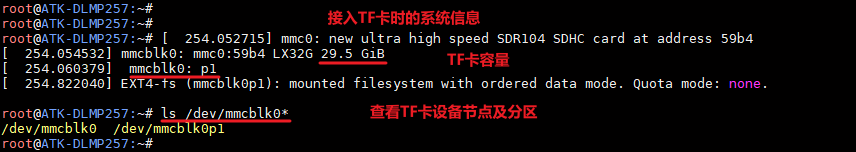
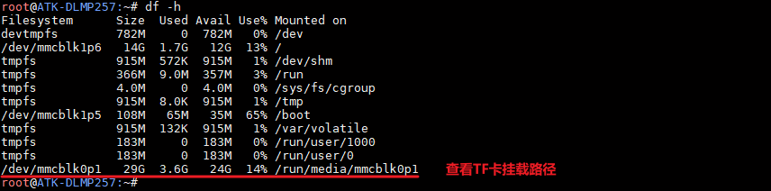
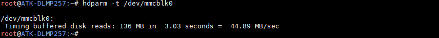
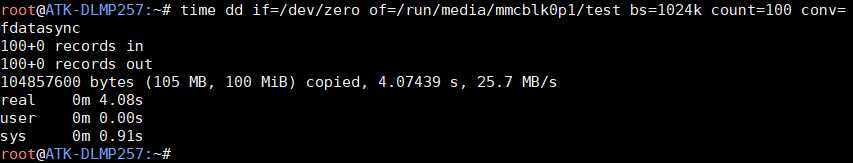

# 4.22 TF卡测试

&emsp;&emsp;指令提示：

&emsp;&emsp;time 命令常用于测量一个命令的运行时间，dd 用于复制，从if(input file)文件读出，写到of(output file)指定的文件，bs 是每次写块的大小，count 是读写块的数量。"if=/dev/zero"不产生IO，即可以不断输出数据，因此可以用来测试纯写速度。

&emsp;&emsp;作者是从eMMC启动，可以看到/dev/mmcblk0就是TF卡的设备节点，/dev/mmcblk0p1是TF卡的默认分区。注意需要使用FAT32格式的TF卡。


<center>
<br />
图 4.22 1查看TF卡设备节点及分区
</center>

&emsp;&emsp;使用df -h命令，查看TF卡挂载路径，下图可看出TF卡挂载目录为/run/media/mmcblk0p1。

```c#
df -h
```

<center>
<br />
图 4.22 2 查看TF卡挂载路径
</center>

## 4.22.1 读速度测试

&emsp;&emsp;常用于测试硬盘读取速度的指令有hdparm与dd，此处只演示hdparm读TF卡的速度。（读写速度与所用的TF卡类型有关）

```c#
hdparm -t /dev/mmcblk0
```

<center>
<br />
图 4.22 3 读速度测试
</center>

## 4.22.2 写速度测试

&emsp;&emsp;使用dd指令写100MB数据到TF卡的挂载目录，即/run/media/mmcblk0p1。写入数据越大，越接近实际值。

```c#
time dd if=/dev/zero of=/run/media/mmcblk0p1/test bs=1024k count=100 conv=fdatasync
```

<center>
<br />
图 4.22 4 写速度测试
</center>

&emsp;&emsp;测试完成后，可删除挂载目录/run/media/mmcblk0p1下的“test”测试文件，完成TF卡的写速度测试。


