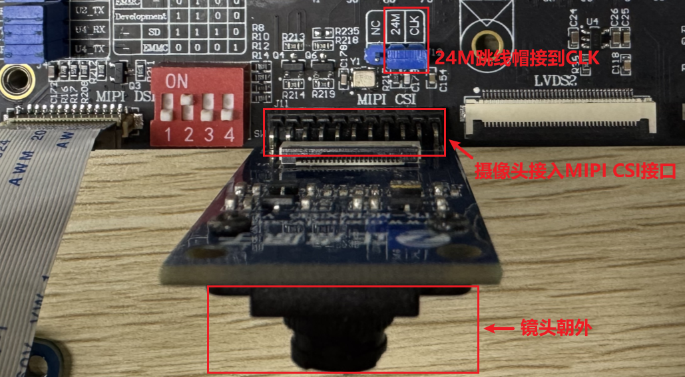

# 4.23 IMX335摄像头测试

&emsp;&emsp;实验前请准备正点原子IMX335 摄像头模块，正点原子的电容屏。

&emsp;&emsp;摄像头插法：摄像头镜头往开发板外侧，直接插到MIPI CSI插口处。插摄像头时需要注意看底板丝印，按引脚编号对应插上，即镜头朝向板子外侧。24M跳线帽接到CLK端，如下图所示：

<center>
<br />
图 4.23 1 摄像头实物连接
</center>

&emsp;&emsp;开机前先插上摄像头和LCD 屏幕（均不支持热插拨），接好设备后再启动开发板。

<center>
<br />
图 4.23 2 启动时IMX335驱动打印的信息
</center>

&emsp;&emsp;查看IMX335生成的节点，确认节点是video0。

```c#
ls /dev/video0
```

<center>
<br />
图 4.23 3 摄像头节点
</center>

&emsp;&emsp;打开QT 界面的“相机”应用，即可打开IMX335摄像头，进行图像采集。如下图所示。

<center>
<br />
图 4.23 4 Qt界面相机功能
</center>

&emsp;&emsp;Qt界面相机功能默认显示界面做成横屏全显，此程序仅供测试参考。

<center>
<br />
图 4.23 5 相机界面预览
</center>

