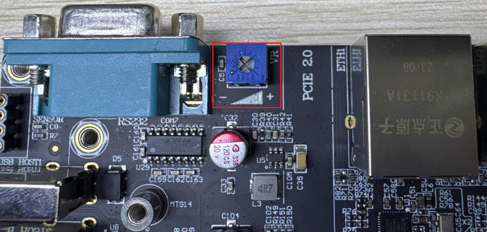

# 4.24 ADC测试

&emsp;&emsp;注意：ADC 的采集电压绝对值最大是1.8V，请不要超过1.8V，否则可能对芯片造成损坏。

&emsp;&emsp;ATK-DLMP257B底板上有一个可调电位器，方便用户测试，位置如下图所示。

<center>
<br />
图 4.24 1 开发板ADC 位置
</center>

&emsp;&emsp;使用下面的指令来获取ADC1 采样的数据，这里读出里出来的值是原始值raw_value。

```c#
cat /sys/bus/iio/devices/iio:device0/in_voltage15_raw
```

<center>
<br />
图 4.24 2 查看raw 的值
</center>

&emsp;&emsp;实际电压值(mV)=in_voltage1_raw * in_voltage_scale。

&emsp;&emsp;其中in_voltage_scale为ADC比例文件(分辨率)，单位为mV，可以通过下面的指令获取，此值跟参考电压有关。

```c#
cat /sys/bus/iio/devices/iio:device0/in_voltage_scale
```

<center>
<br />
图 4.24 3 查看scale 值
</center>

&emsp;&emsp;那么此时ADC1实际电压值为1008* 0.439453125≈442.9mV。调节电位计RP_ADC可以调节ADC电压。
