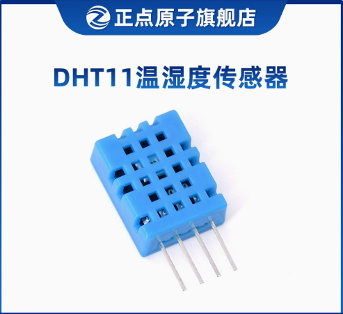
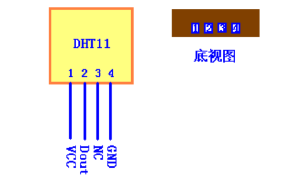
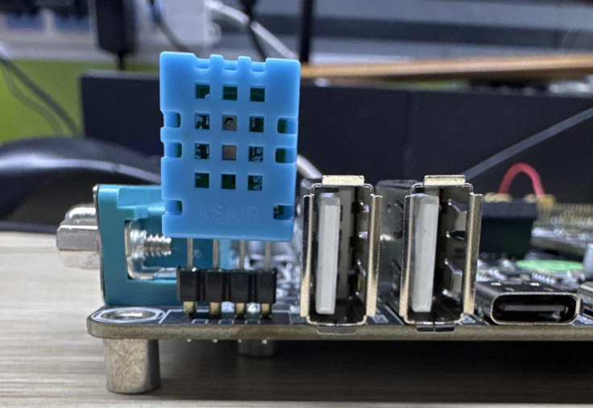
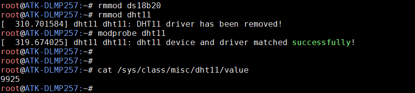

# 4.25 DHT11测试

&emsp;&emsp; DHT11 简介：

&emsp;&emsp;DHT11 是一款湿温度一体化的数字传感器。该传感器包括一个电阻式测湿元件和一个NTC 测温元件，并与一个高性能8 位单片机相连接。通过单片机等微处理器简单的电路连接就能够实时的采集本地湿度和温度。DHT11 与单片机之间能采用简单的单总线进行通信，仅仅需要一个I/O 口。传感器内部湿度和温度数据40Bit 的数据一次性传给单片机，数据采用校验和方式进行校验，有效的保证数据传输的准确性。DHT11 功耗很低，5V 电源电压下，工作平均最大电流0.5mA。正点原子也提供了Linux 下的驱动，方便大家测试与学习。程序仅供参考。

&emsp;&emsp;此实验需要准备DHT11 模块，可在天猫正点原子旗舰店购买。

<center>
<br />
图 4.25 1 DHT11 模块
</center>

&emsp;&emsp;正点原子淘宝DHT11 的技术参数如下：<br />
&emsp;&emsp;工作电压范围：3.3V-5.5V<br />
&emsp;&emsp;工作电流：平均0.5mA<br />
&emsp;&emsp;输出：单总线数字信号<br />
&emsp;&emsp;测量范围：湿度20~90％RH，温度0~50℃<br />
&emsp;&emsp;精度：湿度±5%，温度±2℃<br />
&emsp;&emsp;分辨率：湿度1%，温度1℃<br />
&emsp;&emsp;DHT11 模块的管脚排列如下图，下图为正面视图，有孔的一面为正面。


<center>
<br />
图 4.25 2 DHT11 正视图与底视图
</center>

&emsp;&emsp;ATK-DLMP257B开发板的左上角，也就是USB接口和RS232接口之间留出了一个单排圆孔母座4Pin的座子，可以用于连接DHT11。根据丝印可知DHT11正面有孔的一面朝向开发板外侧。注意不要插错方向。

<center>
<br />
图 4.25 3 DHT11连接示意图
</center>

&emsp;&emsp;因为DS18B20 与DHT11驱动加载可能有先后顺序，所以它们在驱动注册时申请同一个管脚时会有一个驱动加载失败。所以我们可以在文件系统命令行下重新加载对应的驱动即可！

&emsp;&emsp;使用DHT11 模块时，先卸载DS18B20 的驱动，再重新加载DHT11 的驱动。

```c#
rmmod ds18b20	 	//卸载DS18B20 的驱动
rmmod dht11	 		//卸载DHT11 的驱动
modprobe dht11 		//安装DHT11 的驱动
```

&emsp;&emsp;使用下面的指令获取DHT11 模块的数据。如下图：前两位数字是湿度数据，后面两位是温度数据，如若获取到只有三位数据或者两位数据，请自行根据所在环境判断，或者修改驱动来改写打印的格式即可。驱动仅供参考。

```c#
cat /sys/class/misc/dht11/value
```

<center>
<br />
图 4.25 4 读取DHT11 的数据
</center>

&emsp;&emsp;上面读出来的数据是99％RH，25℃。


