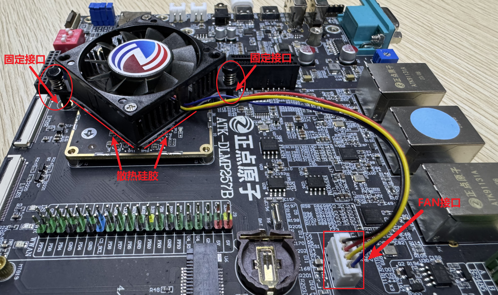

# 4.26 FAN接口测试

&emsp;&emsp;实验前请准备正点原子散热风扇套件。

&emsp;&emsp;散热风扇插法：将散热硅片贴到散热风扇背面，然后将散热风扇定位柱接入开发板底板上的固定孔上并确保安装牢固，将散热风扇的排线接到开发板的FAN接口，效果参考如下：

<center>
<br />
图 4.26 1散热套件接法
</center>

&emsp;&emsp;连接好后，开发板上电，默认会开启风扇，效果如下：

<center>
<br />
图 4.26 2散热风扇运行
</center>

&emsp;&emsp;散热风扇使用PWM控制，控制风扇转速示例：


```c#
echo 0 > /sys/class/pwm/pwmchip0/export
echo 500000 > /sys/class/pwm/pwmchip0/pwm0/period
echo 430000 > /sys/class/pwm/pwmchip0/pwm0/duty_cycle
echo "normal" > /sys/class/pwm/pwmchip0/pwm0/polarity
echo 1 > /sys/class/pwm/pwmchip0/pwm0/enable
```

&emsp;&emsp;因为散热风扇使用的是TIM17_CH1N，此极性与TIM17_CH1相反。此款散热风扇高电平的频率越高，风扇转速越快，在没有手动修改极性的情况下，越提高占空比duty_cycle，高电平频率越低，风扇转速越慢。


