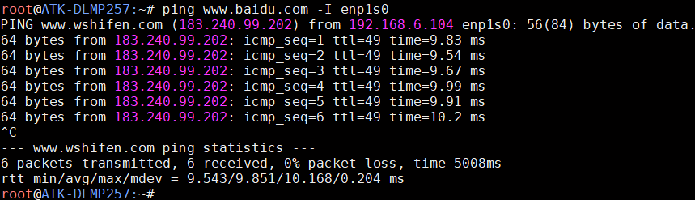

# 4.27 PCIE2.0 x1接口测试

&emsp;&emsp;ATK-DLMP257B开发板引出了一路PCIE2.0 x1接口，可以外接PCIE2.0 x1接口的设备。

<center>
<br />
图 4.27 1 开发板PCIE2.0 x1接口
</center>

## 4.27.1 PCIE 2.5Gbps网卡测试

&emsp;&emsp;笔者手头上有个PCIE2.0接口的网卡模块，通过接这个模块进行测试。正点原子没有售卖此模块，用户可以自行在网上购买。用户手头上有PCIE 2.0接口的设备也可以进行测试。

<center>
<br />
图 4.27 2 开发板接PCIE2.0设备
</center>

&emsp;&emsp;用lspci命令查询识别出的PCIE设备信息：

```c#
lspci
```

<center>
<br />
图 4.27 3 PCIE网卡信息
</center>

<center>
<br />
图 4.27 4 PCIE网卡设备名
</center>

<center>
<br />
图 4.27 5 PCIE网卡测试
</center>

&emsp;&emsp;笔者这个PCIE网卡是2.5Gbps的，在千兆网接口主机上只能测试出千兆的速率，参考如下：

<center>
<br />
图 4.27 6 接千兆网效果
</center>

&emsp;&emsp;在2.5Gbps接口主机上测试出的速率，参考如下，测试数值仅供参考：

<center>
<br />
图 4.27 7 接2.5Gbps接口测试
</center>

## 4.27.2 PCIE固态硬盘测试

&emsp;&emsp;笔者手头上有个PCIE2.0转M.2 SSD转接模块，通过接这个模块可以接入M.2 PCIE固态硬盘进行测试，此模块和固态硬盘可以在网上自行购买，正点原子没有售卖。

<center>
<br />
图 4.27 8 PCIE2.0转M.2 SSD转接模块+M.2 PCIE固态硬盘测试
</center>

&emsp;&emsp;使用lspci指令查询是否有pcie设备，可以看到笔者这里是一个SSD硬盘设备。

```c#
lspci
```

<center>
<br />
图 4.27 9 pci设备信息
</center>

&emsp;&emsp;使用fdisk指令查看SSD硬盘信息。

```c#
fdisk -l
```

<center>
<br />
图 4.27 10 查看SSD硬盘设备信息
</center>

&emsp;&emsp;由于笔者这个是新的固态硬盘，需要分区、格式化后才能使用，如果不是新的固态硬盘一定要跳过这步直接进行挂载，因为格式化会清理数据。

```c#
fdisk /dev/nvme0n1
```

<center>
<br />
图 4.27 11 分区指令参考
</center>

&emsp;&emsp;根据提示信息操作，输入n开始分区，再输入p进行分区，分区号和分区起始地址使用默认的即可，按两下回车键继续操作，最后输入w保存配置。分区完成后，会生成/dev/nvme0n1p1分区，接着进行格式化

```c#
mkfs.ext4 /dev/nvme0n1p1
```

<center>
<br />
图 4.27 12 格式化硬盘
</center>

&emsp;&emsp;格式化完后，就可以使用mount指令挂载。

```c#
mount /dev/nvme0n1p1  /mnt
df -h
```

<center>
<br />
图 4.27 13 挂载硬盘
</center>

&emsp;&emsp;硬盘挂载成功后，可以进行读写测试：

&emsp;&emsp;常用于测试硬盘读取速度的指令有hdparm与dd，此处只演示hdparm读硬盘的速度，速度仅供参考。

```c#
hdparm -t /dev/nvme0n1p1
```

<center>
<br />
图 4.27 14 硬盘读测试
</center>

&emsp;&emsp;使用dd指令写1000MB数据到硬盘的挂载目录，即/mnt。写入数据越大，越接近实际值，速度仅供参考。

```c#
time dd if=/dev/zero of=/mnt/test bs=1024k count=1000 conv=fdatasync
```

<center>
<br />
图 4.27 15 硬盘写测试
</center>


