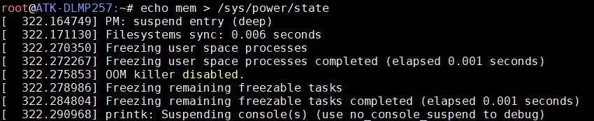
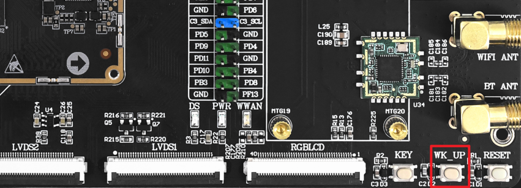
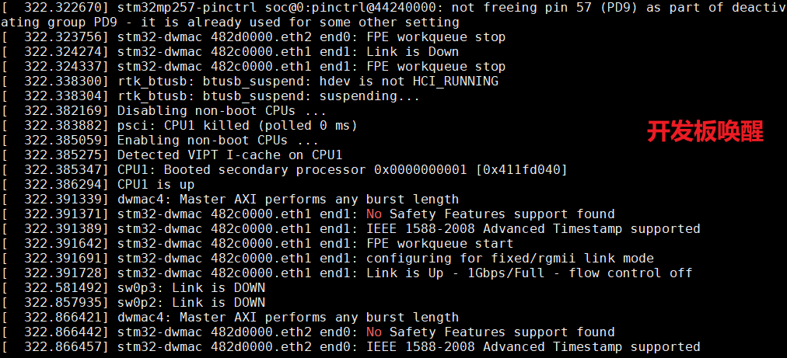

# 4.28 WK_UP按键测试

&emsp;&emsp;ATK-DLMP257B开发板上有一个WK_UP按键，默认配置为休眠唤醒功能，测试方法如下：

&emsp;&emsp;执行下面指令，让开发板进入休眠模式：

```c#
echo mem > /sys/power/state
```

<center>
<br />
图 4.28 1 休眠指令
</center>

&emsp;&emsp;开发板休眠后，按一下开发板上的WK_UP按键，即可唤醒开发板。

<center>
<br />
图 4.28 2 WK_UP按键
</center>

<center>
<br />
图 4.28 3 开发板唤醒信息
</center>


