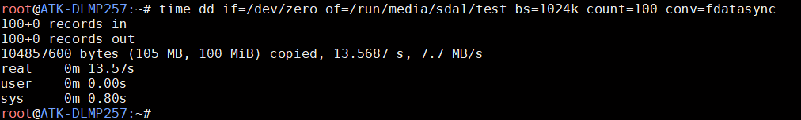

# 4.29 USB_OTG接口测试

&emsp;&emsp;ATK-DLMP257B开发板上有一个USB_OTG接口，此接口可以用于上位机USB模式烧写，参考第三章。也可以接一个OTG转USB线来外接USB设备，这里笔者用TF卡+读卡器来代替U盘，接法示例如下：

<center>
<br />
图 4.29 1 USB_OTG
</center>

&emsp;&emsp;启动系统后，接入U盘，可以看到USB驱动信息：

<center>
<br />
图 4.29 2 USB_OTG接口接U盘时的信息
</center>

&emsp;&emsp;输入df -h 命令，查看U 盘当前挂载路径。

```c#
df -h
```

<center>
<br />
图 4.29 3 查看U 盘挂载路径
</center>

&emsp;&emsp;上图可看出，当前U 盘挂载路径为/run/media/sda1，下面进行U 盘读写速度测试。

&emsp;&emsp;提示，读卡器本身的接口读写速度及TF 卡种类、U 盘种类等也会影响速度值快慢，用户测试值可能与编者测试值不同，速度值仅供参考。

&emsp;&emsp;写速度测试：

&emsp;&emsp;输入下面命令，向U 盘写入测试文件：

```c#
time dd if=/dev/zero of=/run/media/sda1/test bs=1024k count=100 conv=fdatasync
```

<center>
<br />
图 4.29 4 U盘写入测试
</center>

&emsp;&emsp;上面表示写入一个100MiB 的test 文件。实际上写入的文件越大，求平均写入速度越接近实际值。拔出U 盘之前执行一遍sync 命令，同步到存储磁盘。

&emsp;&emsp;读速度测试：

&emsp;&emsp;输入下面指令,清理运行缓存。

```c#
echo 3 > /proc/sys/vm/drop_caches
```

&emsp;&emsp;小提示：因为LINUX 的内核机制，一般情况下不需要特意去释放已使用的cache。这些cache 内容可以增加文件的读写速度。这里为了测试读写速度，故需执行释放。

&emsp;&emsp;输入下面指令,读取前面用dd 指令写入的test 文件。

```c#
time dd if=/run/media/sda1/test of=/dev/null bs=1024k
```

<center>
<br />
图 4.29 5 读取速度
</center>

&emsp;&emsp;这里表示读取100MiB 数据。读卡器的读写速度等也会影响此速度值，仅供参考。


