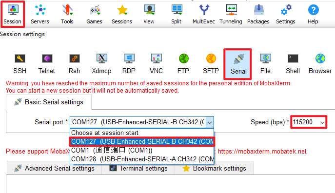
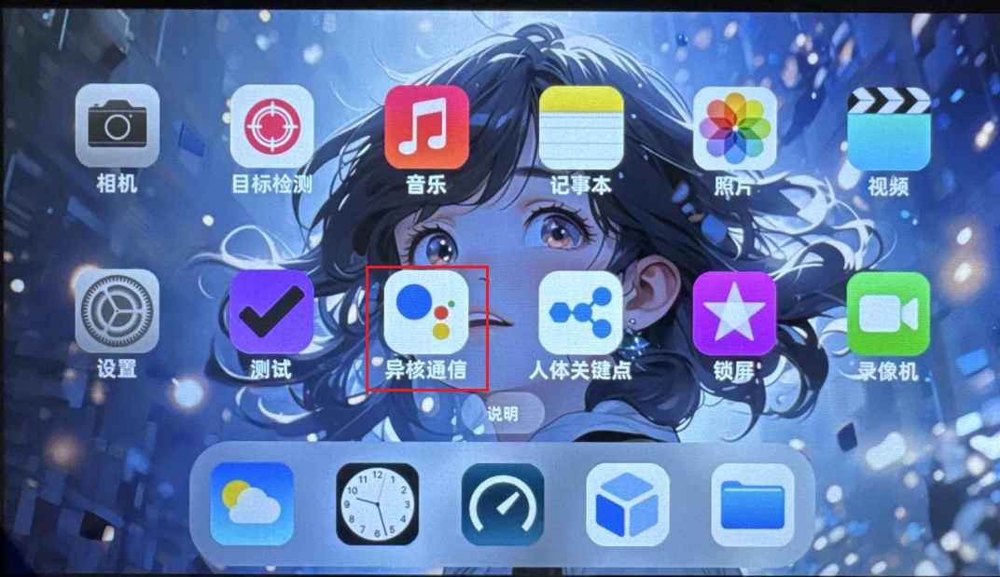
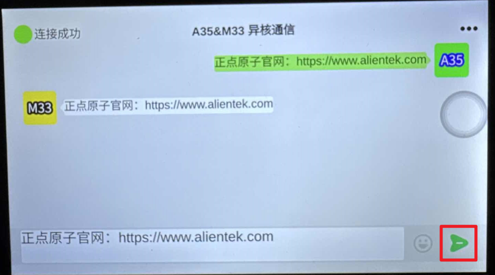

# 4.30 A35&M33异核通信测试

&emsp;&emsp;ATK-DLMP257B开发板有一个M33核，具体用法可以看网盘资料里的【正点原子】ATK-DLMP257B异核通信快速开发手册。在串口终端，选择USB-Enhanced-SERIAL-B-CH342，就可以打开M核串口，波特率115200，查看调试信息。

 
图 4.30 1打开M核调试串口

&emsp;&emsp;在出厂系统QT界面上有一个异核通信的示例，可以用于简单测试M33，示例如下：

 
图 4.30 2 异核通信Qt示例

&emsp;&emsp;点击示例里右下角的发送，即可进行A35和M33的异核通信示例。

 
图 4.30 3 点击发送，演示示例

&emsp;&emsp;在M核上也能看到相关信息：

 
图 4.30 4 M核串口信息

