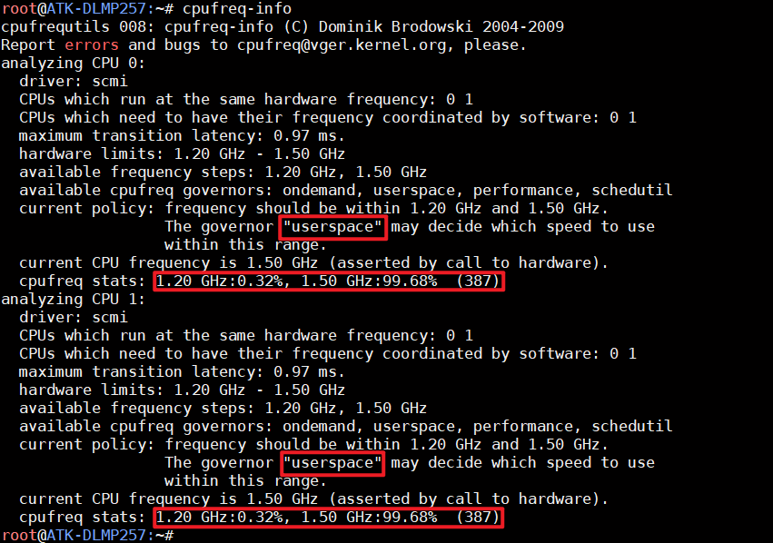
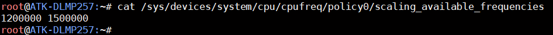
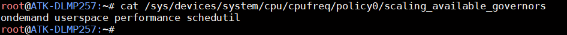
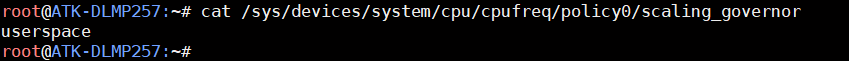
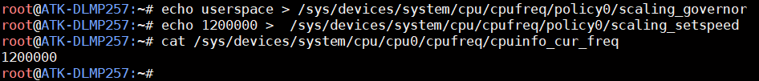

# 4.33 CPU主频

&emsp;&emsp;使用cpufreq-info 指令查看CPU 主频。

```c#
cpufreq-info
```

<center>
<br />
图 4.33 1 查看CPU主频
</center>

&emsp;&emsp;通过以上结果可知，CPU0 和CPU1 工作在1.20GHz 到1.50GHz 之间，当前的 CPU 频率为1.50 GHz,调频模式为“userspace”，频率由用户空间的应用程序手动设置，而不是自动调整。

&emsp;&emsp;查看可用的CPU主频：

```c#
cat /sys/devices/system/cpu/cpufreq/policy0/scaling_available_frequencies
```

<center>
<br />
图 4.33 2 查看可用的CPU主频
</center>

&emsp;&emsp;查看可用的调频策略：

```c#
cat /sys/devices/system/cpu/cpufreq/policy0/scaling_available_governors
```

<center>
<br />
图 4.33 3查看可用的调频策略
</center>

&emsp;&emsp;可用的 CPU 频率调节模式（Governor）包括：<br />
&emsp;&emsp;ondemand（按需调整，适用于MP1系列）<br />
&emsp;&emsp;userspace（用户空间手动控制）<br />
&emsp;&emsp;performance（高性能模式，固定最高频率）<br />
&emsp;&emsp;schedutil（基于调度器优化的动态调整，适用于MP2系列）

&emsp;&emsp;查看当前的调频策略：

```c#
cat /sys/devices/system/cpu/cpufreq/policy0/scaling_governor
```

<center>
<br />
图 4.33 4 查看当前的调频策略
</center>

&emsp;&emsp;出厂系统默认由QT程序配置为userspace，由用户空间控制主频为最高主频1.5GHz。

&emsp;&emsp;申请用户空间控制 CPU 主频：

```c#
echo userspace > /sys/devices/system/cpu/cpufreq/policy0/scaling_governor
```

&emsp;&emsp;通过用户空间控制，可修改当前CPU主频，例如下面改为1.2GHz主频：

```c#
echo 1200000 >  /sys/devices/system/cpu/cpufreq/policy0/scaling_setspeed
cat /sys/devices/system/cpu/cpu0/cpufreq/cpuinfo_cur_freq
```

<center>
<br />
图 4.33 5 修改CPU主频为1.2GHz
</center>


