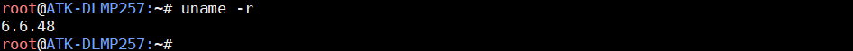
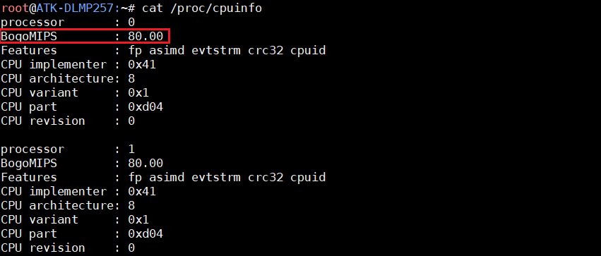
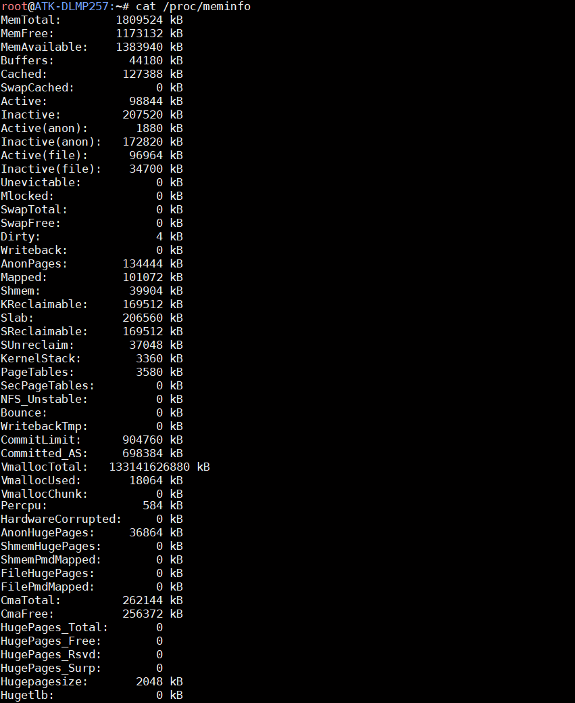
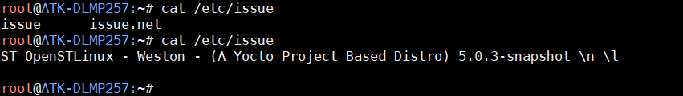

# 4.34 查看系统信息

## 4.34.1 查看系统内核版本

```c#
uname -r
```

<center>
<br />
图 4.34 1 查看系统内核版本
</center>

## 4.34.2 查看主机名

&emsp;&emsp;查看系统主机名，可修改/etc/hostname 来定制个人的主机名。

```c#
cat /etc/hostname
```

<center>
<br />
图 4.34 2 查看系统主机名
</center>

## 4.34.3 查看CPU相关信息

```c#
cat /proc/cpuinfo
```

<center>
<br />
图 4.34 3查看CPU 相关信息
</center>

&emsp;&emsp;如上比如BogoMIPS 这个值，是根据CPU 运行速度的指标，是Linux 操作系统中衡量计算机处理器运行速度的的一种尺度，是由Linux 主要开发者linus Torvalds 通过calibrate_delay（）函数计算出来的，但是只能用来粗略计算处理器的性能，并不十分精确。影响这个值的大小因素是CPU 当前运行的主频。如上80.00 是cpu 运行在400MHZ 时所计算出来的数值。

## 4.34.4 查看内存相关信息

```c#
cat /proc/meminfo
```

<center>
<br />
图 4.34 4 查看内存相关信息
</center>

## 4.34.5 查看系统登陆欢迎信息

```c#
cat /etc/issue
```

<center>
<br />
图 4.34 5 查看系统登陆欢迎信息
</center>


