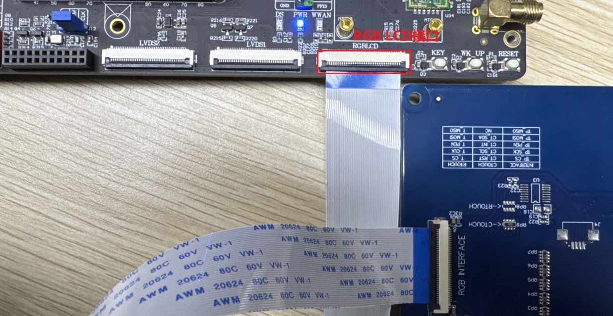

# 4.4 RGB LCD测试

&emsp;&emsp;此节仅适用于选配了正点原子RGB屏幕的开发板用户。

## 4.4.1 使用说明

&emsp;&emsp;正点原子所使用的RGB屏幕有4种，如下表所示：

<div class="stm32mp257_center-table-div">
<table class="stm32mp257_center-table">
  <tr>
    <th>屏幕规格</th>
    <th>触摸芯片</th>
  </tr>
  <tr>
    <td>4.3寸屏（800x480）</td>
    <td>Goodix（汇顶）GT系列</td>
  </tr>
  <tr>
    <td>7寸屏（800x480）</td>
    <td>Goodix（汇顶）GT系列</td>
  </tr>
   <tr>
    <td>7寸屏（1024x600）</td>
    <td>Goodix（汇顶）GT系列</td>
  </tr>
  <tr>
    <td>10.1寸屏（1280x600）</td>
    <td>Goodix（汇顶）GT系列</td>
  </tr>
</table>
</div>

&emsp;&emsp;RGB屏幕接法：使用屏幕配套的40pin反向FPC排线，接法如下（此图仅为方便展示接口，并非实际摆放效果）。开发板FPC座子夹扣朝上打开即松开，朝下打平即加紧。

<center>
<br />
图 4.4 1 RGB屏幕接法
</center>

## 4.4.2 触摸测试

&emsp;&emsp;与4.2 小节方法一样，开发板启动后我们输入cat /proc/bus/input/devices 指令查看触摸屏对应的触摸事件，也可直接在屏幕上进行触摸点击、滑动，测试屏幕是否正常触摸。

## 4.4.3 背光测试

&emsp;&emsp;在默认出厂系统，LCD 屏幕背光支持255个等级的PWM 调节，亮度级数为0～100，默
认为100，最亮状态。设置为0 时，关闭背光。数值越大，屏幕越亮。

```c#
cat /sys/class/backlight/panel-rgb-backlight/max_brightness   //查看背光最大亮度等级
cat /sys/class/backlight/panel-rgb-backlight/brightness 	   //查看当前亮度等级
echo 50 > /sys/class/backlight/panel-rgb-backlight/brightness  //修改当前亮度等级
cat /sys/class/backlight/panel-rgb-backlight/brightness 	   //再查看当前亮度等级
```


