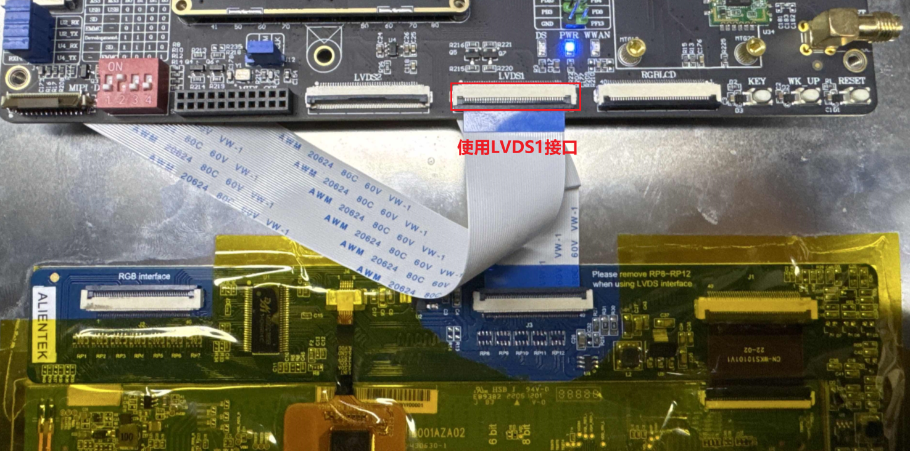
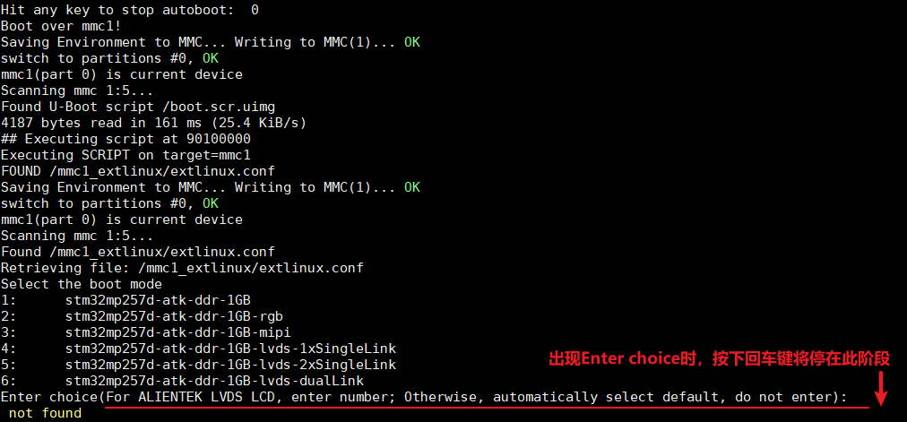
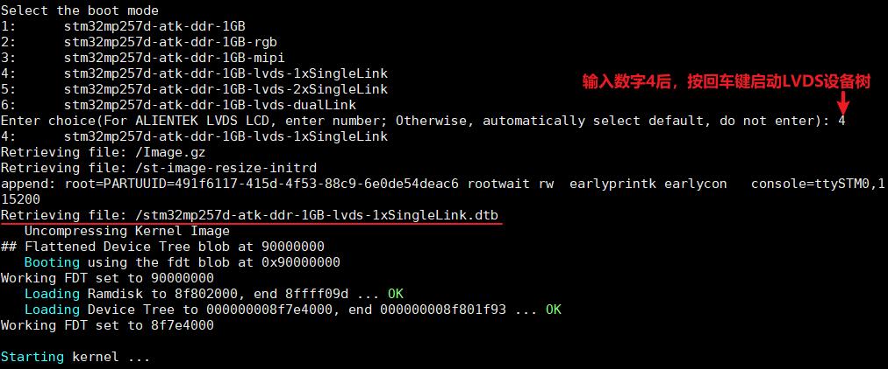

# 4.5 LVDS LCD测试

&emsp;&emsp;此节仅适用于选配了正点原子10.1寸LVDS屏幕的开发板用户。

## 4.5.1 使用说明

&emsp;&emsp;ATK-DLMP257B配置了两路LVDS LCD接口，正点原子LVDS屏幕尺寸为10.1寸，分辨率为1280x800，触摸芯片是Goodix（汇顶）GT系列。

&emsp;&emsp;LVDS屏接法：屏幕排线使用配套的40pin反向软排线，打开开发板LVDS1连接座黑色夹条，排线金属面朝下接入连接座（注意先观察排线金属是否脱落或者短接），合上夹条。屏幕端的排线接法同理。

<center>
<br />
图 4.5 1 LVDS屏幕接法
</center>

&emsp;&emsp;开发板接好LVDS屏幕，接好UART接口后，打开串口终端，启动开发板查看串口信息，当开发板运行到uboot的Enter choice阶段时，按下键盘的Enter键，停留在Enter choice阶段，如下图所示：

<center>
<br />
图 4.5 2 Enter choice阶段
</center>

&emsp;&emsp;根据信息提示，我们需要输入数字4后按回车键，使用对应的lvds设备树启动。

<center>
<br />
图 4.5 3启动LVDS设备树
</center>

&emsp;&emsp;此时观察屏幕，可以看LVDS屏幕启动了。

## 4.5.2 触摸测试

&emsp;&emsp;与4.2 小节方法一样，开发板启动后我们输入cat /proc/bus/input/devices 指令查看触摸屏对应的触摸事件，也可直接在屏幕上进行触摸点击、滑动，测试屏幕是否正常触摸。

## 4.5.3 背光测试

&emsp;&emsp;在默认出厂系统，LCD 屏幕背光支持255个等级的PWM 调节，亮度级数为0～100，默
认为100，最亮状态。设置为0 时，关闭背光。数值越大，屏幕越亮。

```c#
cat /sys/class/backlight/panel-lvds-backlight/max_brightness   //查看背光最大亮度等级
cat /sys/class/backlight/panel-lvds-backlight/brightness 	   //查看当前亮度等级
echo 50 > /sys/class/backlight/panel-lvds-backlight/brightness  //修改当前亮度等级
cat /sys/class/backlight/panel-lvds-backlight/brightness 	   //再查看当前亮度等级
```

