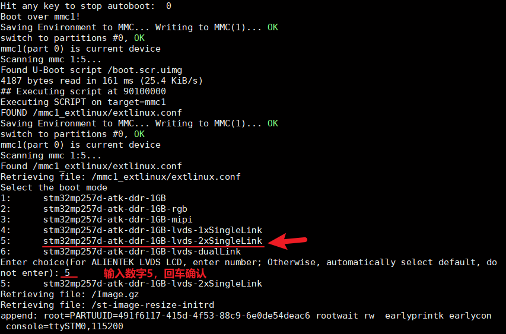
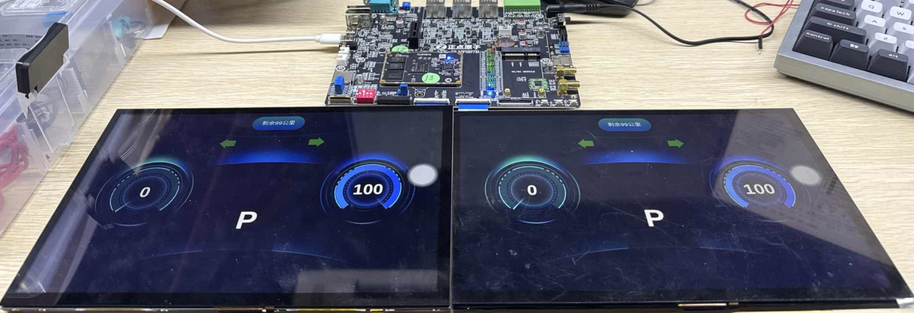

# 4.6 LVDS双屏测试

&emsp;&emsp;ATK-DLMP257B开发板支持LVDS同显，开发板上有LVDS1和LVDS2两个接口，可以同时接两个正点原子10.1寸LVDS屏幕，LVDS1支持触摸，LVDS2不支持触摸。

&emsp;&emsp;开发板接好两个正点原子的LVDS屏幕后，启动开发板，在uboot引导启动界面选择第5个设备树stm32mp257d-atk-ddr-1GB-lvds-2xSingleLink或stm32mp257d-atk-ddr-2GB-lvds-2xSingleLink。

 
图 4.6 1 选择双屏LVDS设备树

&emsp;&emsp;进入系统界面后，在两个屏幕会显示一样的内容，LVDS1接口的屏幕可以触摸，LVDS2接口的不支持触摸，两个屏幕会随LVDS1接口的触摸效果变动，示例如下：

 
图 4.6 2双屏LVDS效果

