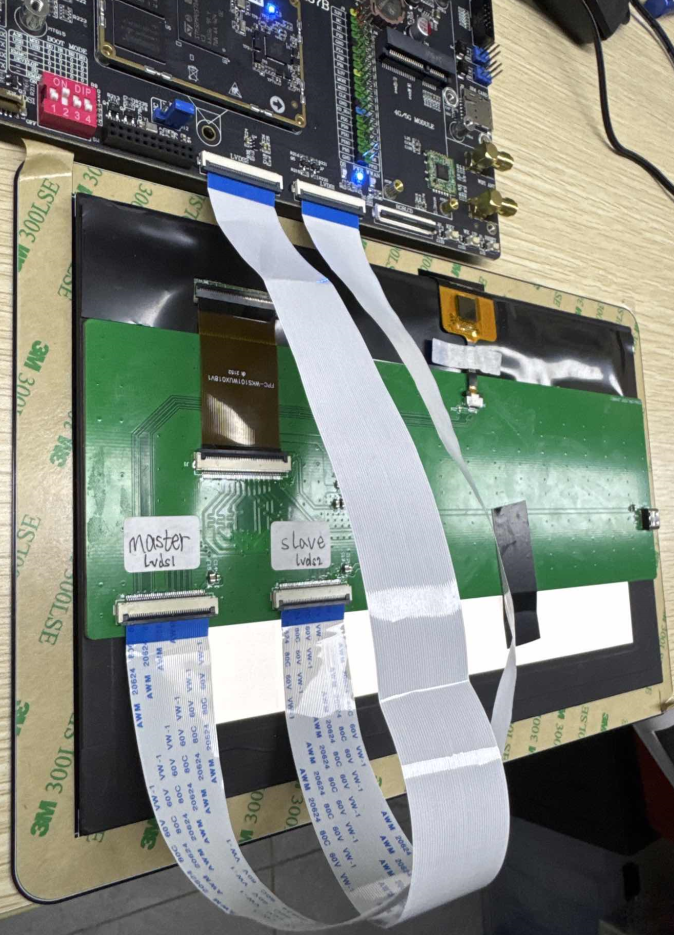
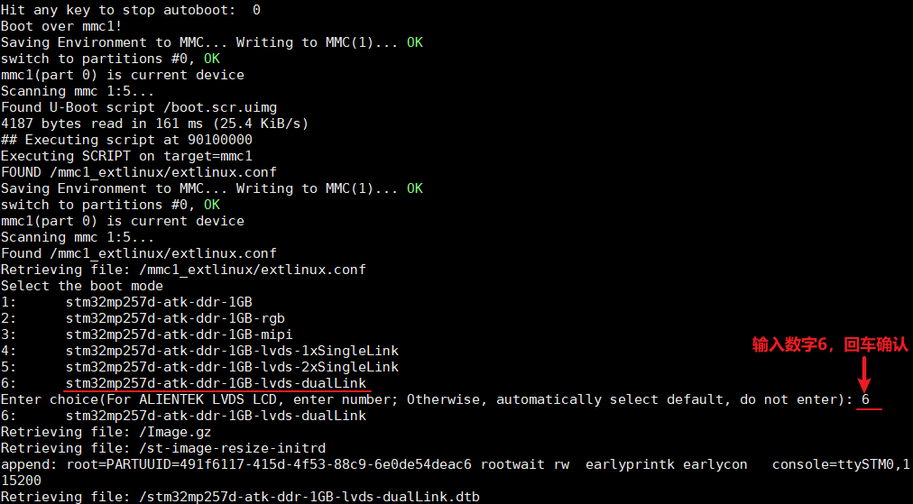
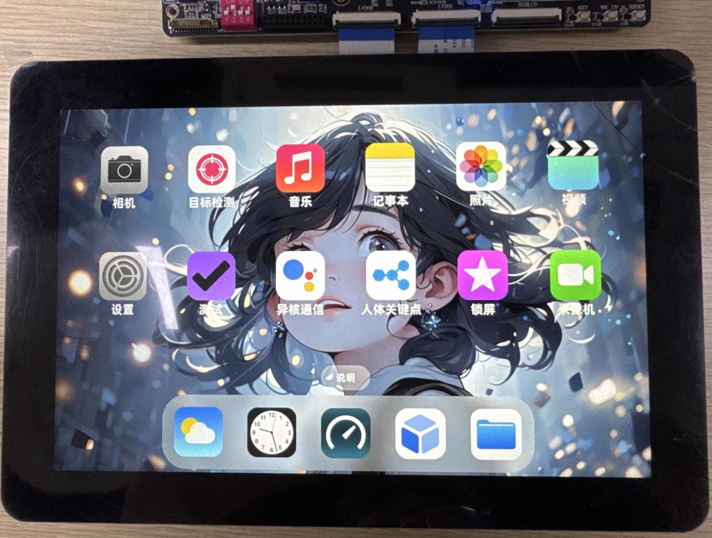

# 4.7 8 lanes LVDS屏幕测试

&emsp;&emsp;ATK-DLMP257B开发板支持8 lanes LVDS屏幕，正点原子店铺没有出售此屏幕，有需要的用户可以自行在淘宝其他店铺购买。

&emsp;&emsp;开发板上有LVDS1和LVDS2两个接口，每个接口各4 lanes，可以接在同个屏幕上，共计8 lanes，LVDS1接在master接口，LVDS2接在slave接口，示例如下：

 
图 4.7 1 8 lanes屏幕接线示例

&emsp;&emsp;开发板接好8 lanes LVDS屏幕后，启动开发板，在uboot引导启动界面选择第6个设备树stm32mp257d-atk-ddr-1GB-lvds-dualLink或者stm32mp257d-atk-ddr-2GB-lvds-dualLink

 
图 4.7 2 选择8 lanes(双线)设备树

&emsp;&emsp;显示效果如下：

 
图 4.7 3 8 lanes屏幕效果

