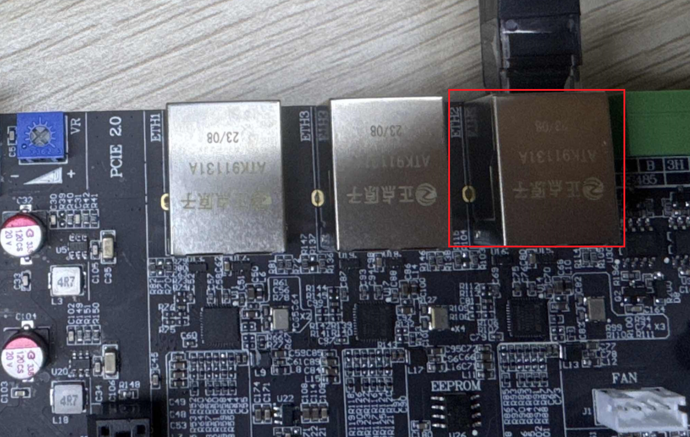
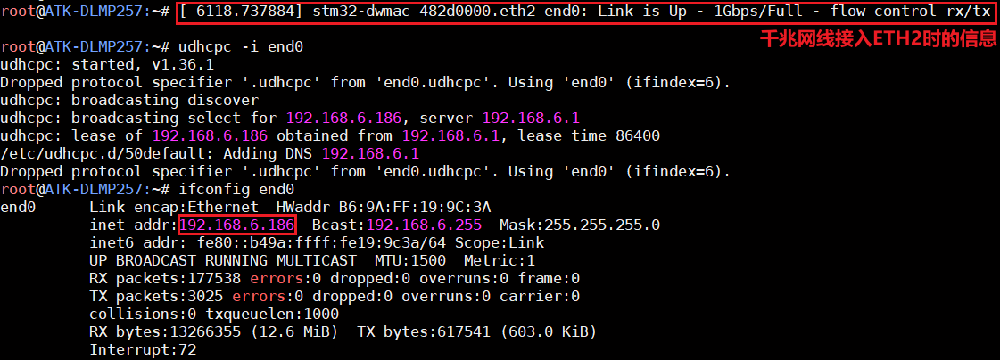
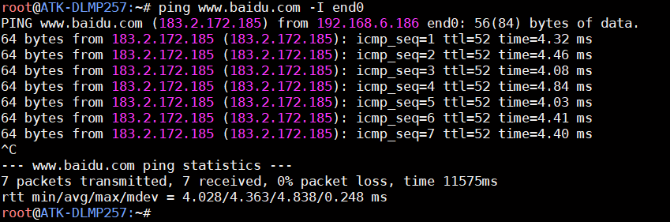
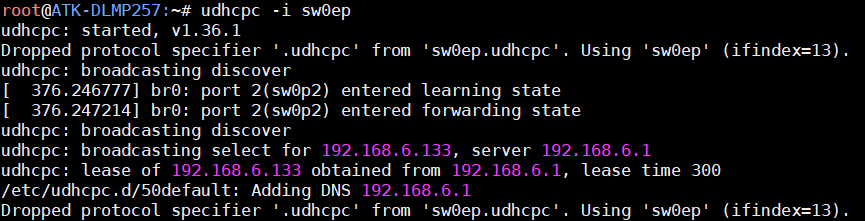
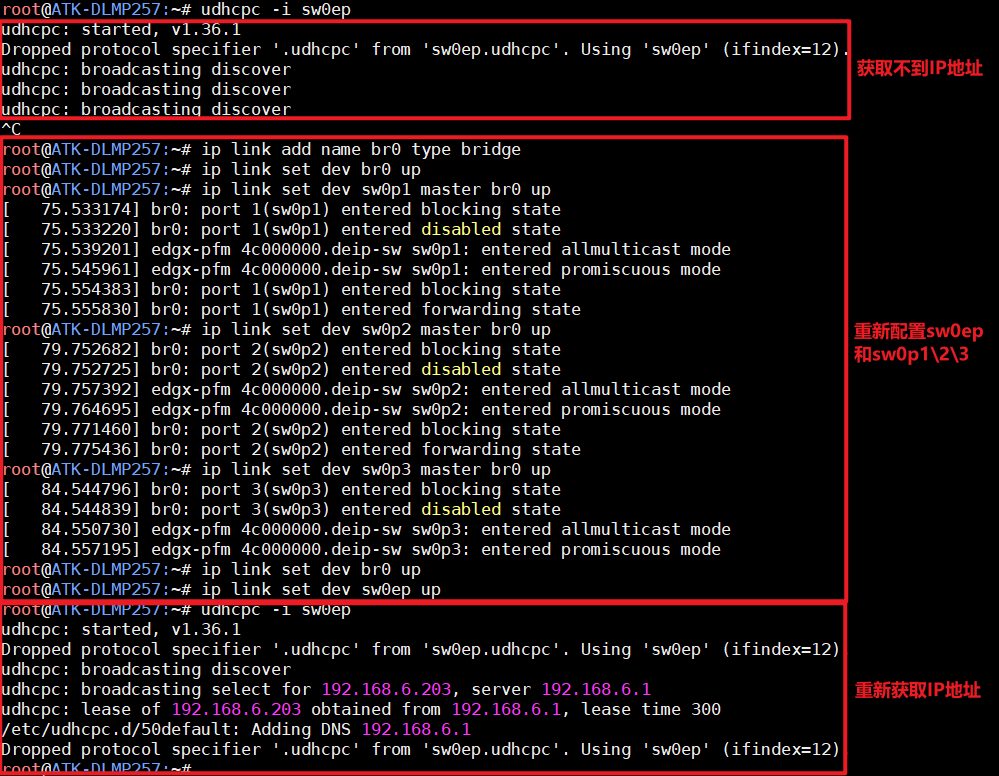

# 4.8 以太网接口测试

## 4.8.1 联网测试

&emsp;&emsp;ATK-DLMP257开发板板载3 路千兆以太网，自适应10/100/1000M 速率。 

&emsp;&emsp;首先将网线接入到网口处，另一端连接到路由器或者交换机，确保能上网。开发板出厂系统将根据本地网络环境自动获取到上网IP 地址（出厂系统支持DHCP），输入ifconfig 命令查看获取到的网络IP地址。下面举例接入网口ETH2，对应网络节点end0，这个网口是我们常用的常规千兆以太网。

<center>
<br />
图 4.8 1网线接到ETH2
</center>

```c#
udhcpc -i end0
ifconfig end0
```

<center>
<br />
图 4.8 2 ETH2(end0)获取外网IP地址
</center>

&emsp;&emsp;检查网络能否上网，如果有数据回复，则说明网络功能正常。按Ctrl+c 终止指令。

```c#
ping www.baidu.com -I end0
```

<center>
<br />
图 4.8 3 联网测试
</center>

&emsp;&emsp;如果本地网络非上网环境（局域网），则通过配置静态IP 方式来测试网络通信。例如开发板配置网口ETH2 网络静态IP：ifconfig eth0 192.168.6.100。PC（电脑端）配置静态IP192.168.6.200。两者进行局域网ping 通信测试。注意PC（电脑端）需关闭防火墙即可。

&emsp;&emsp;对于ETH1和ETH3，我们可以将对应网口接好网线后，使用下面指令测试。

```c#
udhcpc -i sw0ep
```

<center>
<br />
图 4.8 4 ETH1\ETH3获取IP
</center>

&emsp;&emsp;三个网口均可以使用千兆网络测试，这里笔者使用iperf指令测试，网口接入的交换机\路由器也是千兆的，测试效果参考如下：

<center>
<br />
图 4.8 5 千兆网络测试
</center>


