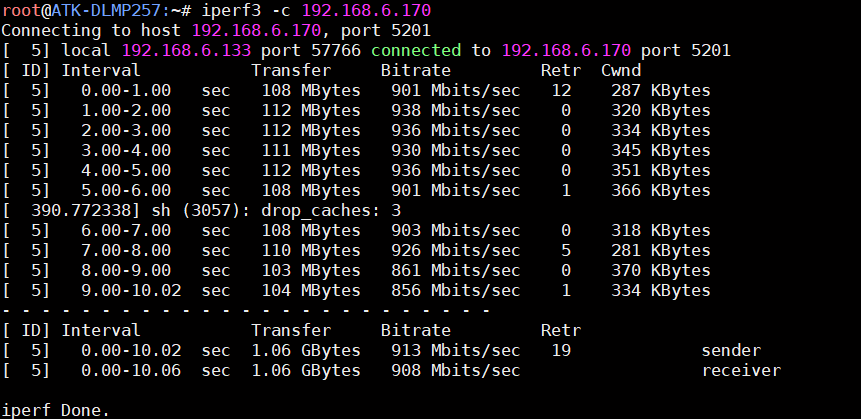

# 4.8 以太网接口测试

&emsp;&emsp;ATK-DLMP257开发板板载3 路千兆以太网，自适应10/100/1000M 速率。值得注意的是，STM32MP257芯片有两个GMAC，ETH2是一路GMAC出来的，另外一路GMAC内置了以太网交换机功能，分出了ETH1和ETH3。也就是说ETH2是常规的以太网功能，ETH1和ETH3是以太网交换机功能。 

## 4.8.1 ETH2联网测试

&emsp;&emsp;首先将网线接入到网口处，另一端连接到路由器或者交换机，确保能上网。开发板出厂系统将根据本地网络环境自动获取到上网IP 地址（出厂系统支持DHCP），输入ifconfig 命令查看获取到的网络IP地址。下面举例接入网口ETH2，对应网络节点end0，这个网口是我们常用的常规千兆以太网。

<center>
<br />
图 4.8 1网线接到ETH2
</center>

```c#
udhcpc -i end0
ifconfig end0
```

<center>
<br />
图 4.8 2 ETH2(end0)获取外网IP地址
</center>

&emsp;&emsp;检查网络能否上网，如果有数据回复，则说明网络功能正常。按Ctrl+c 终止指令。

```c#
ping www.baidu.com -I end0
```

<center>
<br />
图 4.8 3 联网测试
</center>

&emsp;&emsp;如果本地网络非上网环境（局域网），则通过配置静态IP 方式来测试网络通信。例如开发板配置网口ETH2 网络静态IP：ifconfig eth0 192.168.6.100。PC（电脑端）配置静态IP192.168.6.200。两者进行局域网ping 通信测试。注意PC（电脑端）需关闭防火墙即可。

## ETH1\3联网测试

&emsp;&emsp;对于ETH1或ETH3，我们可以将对应网口接好网线后，使用下面指令测试，注意以下操作只需要接ETH1或者ETH3，不能同时接ETH1和ETH3，ETH1和ETH3主要用于交换机功能，具体操作可以看资料**STM32MP257开发板\10、用户手册\【正点原子】ATK-DLMP257B以太网交换机开发指南**。

```c#
udhcpc -i sw0ep
```

<center>
<br />
图 4.8 4 ETH1\ETH3获取IP
</center>

&emsp;&emsp;如果获取不到IP地址，可以执行下面指令，重新配置sw0ep和sw0p1\2\3，再获取IP地址：

```c#
ip link add name br0 type bridge
ip link set dev br0 up
ip link set dev sw0p1 master br0 up
ip link set dev sw0p2 master br0 up
ip link set dev sw0p3 master br0 up
ip link set dev br0 up
ip link set dev sw0ep up
udhcpc -i sw0ep
```

<center>
<br />
图 4.8 5 更新sw0ep和sw0p1\2\3配置后重新获取IP地址
</center>

&emsp;&emsp;三个网口均可以单独使用千兆网络测试，这里笔者使用iperf指令测试，网口接入的交换机\路由器也是千兆的，测试效果参考如下：

<center>
<br />
图 4.8 6 千兆网络测试
</center>


