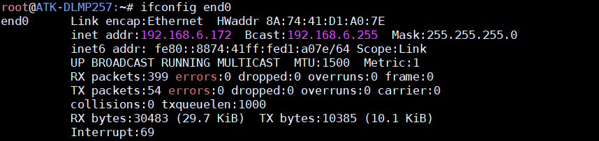
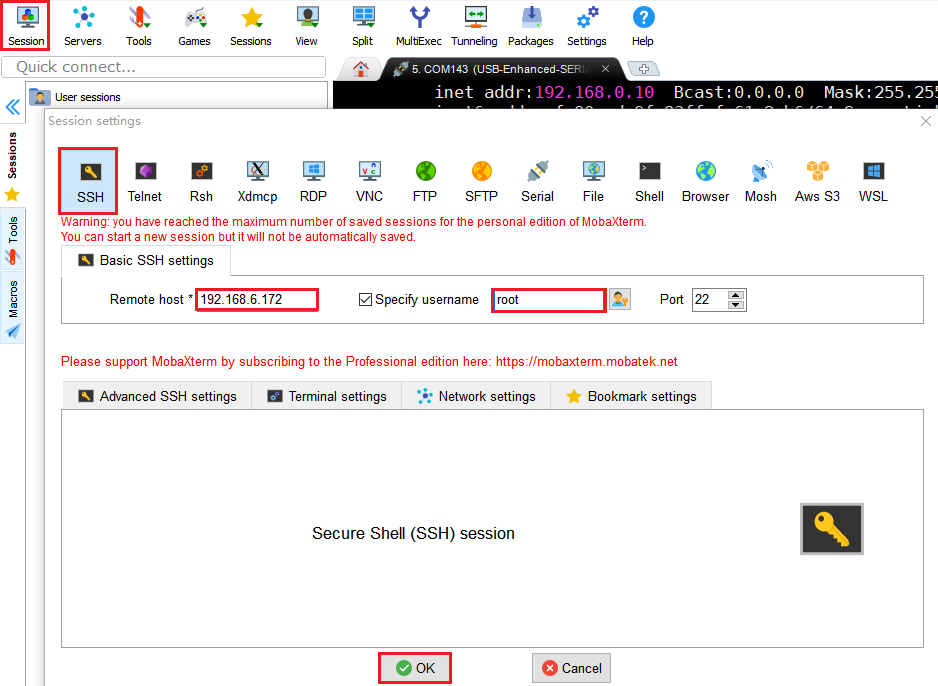
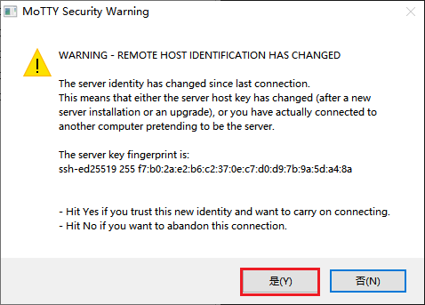
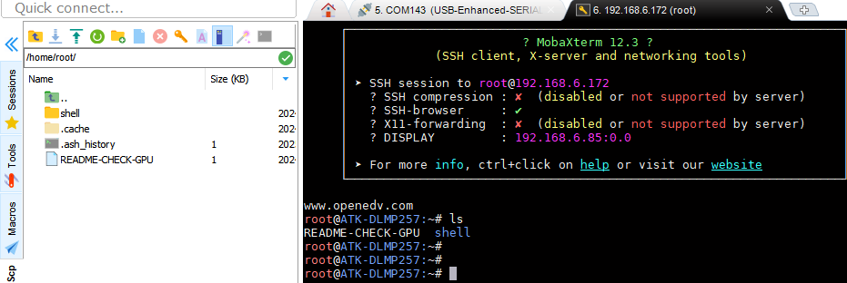
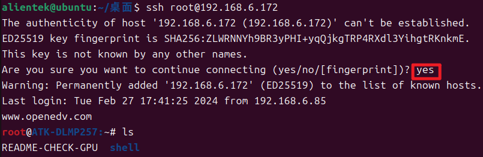

# 5.2 SSH登陆

&emsp;&emsp;开发板出厂系统默认支持SSH登陆，使用之前需确保开发板连接上网络，这里笔者的开发板IP地址为192.168.6.172

<center>
<br />
图 5.2 1 查询开发板IP地址
</center>

&emsp;&emsp;开发板获取到有效的IP地址后，登陆操作如下。

<center>
<br />
图 5.2 2 mobaxterm登陆
</center>

<center>
<br />
图 5.2 3 确认登陆
</center>

<center>
<br />
图 5.2 4 登陆效果
</center>

&emsp;&emsp;如果ubuntu配置好了SSH服务，也可以使用命令行SSH登陆，指令参考如下：

```c#
ssh root@192.168.6.172
```

<center>
<br />
图 5.2 5 命令行SSH登陆
</center>


