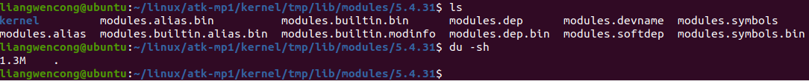

# 6.1 安装通用ARM交叉编译工具链

&emsp;&emsp;请参考【正点原子】STM32MP1嵌入式Linux驱动开发指南V1.x.pdf中的第4章。

## 6.1.1 编译TF-A

&emsp;&emsp;请参考【正点原子】STM32MP1嵌入式Linux驱动开发指南V1.x.pdf中的第六章。

## 6.1.2 编译U-Boot

&emsp;&emsp;请参考【正点原子】STM32MP1嵌入式Linux驱动开发指南V1.x.pdf中的第十章。

## 6.1.3 编译内核

&emsp;&emsp;1.	编译内核

&emsp;&emsp;请参考【正点原子】STM32MP1嵌入式Linux驱动开发指南V1.x.pdf中的第十七章。

&emsp;&emsp;2.	编译模块

&emsp;&emsp;当内核编译成功后，就可以编译内核模块了，运行以下命令进行编译：

```c#
make ARCH=arm CROSS_COMPILE=arm-none-linux-gnueabihf- modules -j32 //编译模块
mkdir tmp //新建tmp目录，用作存放模块
make ARCH=arm INSTALL_MOD_PATH=./tmp modules_install //编译好的模块打包到tmp
rm -rf tmp/lib/modules/5.4.31/source                 //删除source目录
rm -rf tmp/lib/modules/5.4.31/build                  //删除build目录
find ./tmp -name "*.ko" | xargs arm-none-linux-gnueabihf-strip --strip-debug --remove-section=.comment --remove-section=.note --preserve-dates  //裁剪模块，把模块的调试信息去掉
```

&emsp;&emsp;编译成功后，在tmp/lib/modules/5.4.31目录下生成模块，经过裁剪后的模块总大小才1.3M。如下图所示：

<center>
<br />
图6.1.3.1 编译好的模块
</center>


