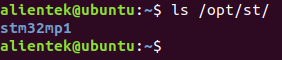
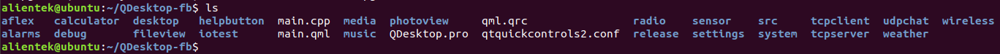
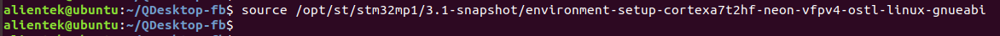
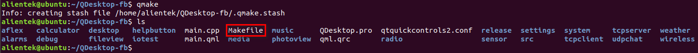
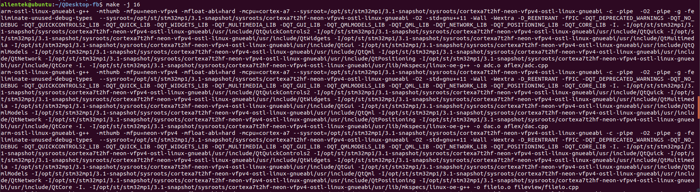
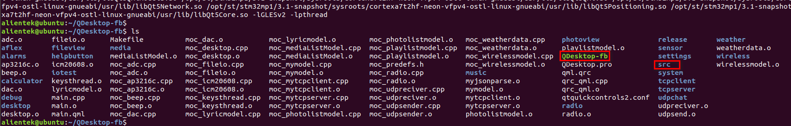
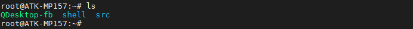
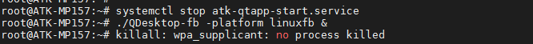
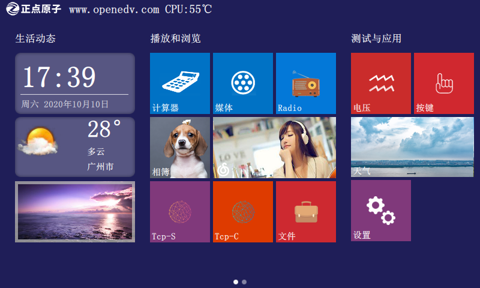

# 6.2 安装含编译Qt应用程序的交叉编译工具链

&emsp;&emsp;前面所安装的通用ARM交叉编译工具链是不能编译Qt应用程序的。所以还需要装能编译Qt应用程序的交叉编译工具链。

&emsp;&emsp;在`开发板光盘A-基础资料->5、开发工具->1、交叉编译器`路径下找到st-example-image-qtwayland-openstlinux-weston-stm32mp1-x86_64-toolchain-3.1-snapshot.sh。将它拷贝到Ubuntu虚拟机上（温馨提醒，ATK-STM32MP157教学都是使用Ubuntu18.04开发，建议使用Ubuntu18.04，是为了用户的环境与作者的环境一样，出错也好解决）。

&emsp;&emsp;拷贝到Ubuntu后，赋予`st-example-image-qtwayland-openstlinux-weston-stm32mp1-x86_64-toolchain-3.1-snapshot.sh`可执行权限。

```c#
chmod +x st-example-image-qtwayland-openstlinux-weston-stm32mp1-x86_64-toolchain-3.1-snapshot.sh
```

&emsp;&emsp;然后直接执行它，直接安装，安装过程中会询问安装的目录，我们默认即可，按Enter继续。安装需要耗时较长，请耐心等待。

```c#
./st-example-image-qtwayland-openstlinux-weston-stm32mp1-x86_64-toolchain-3.1-snapshot.sh
```

&emsp;&emsp;安装完成后，安装的交叉编译工具链都会安装在/opt/目录下。

```c#
ls /opt/st/
```

<center>
<br />
图6.2 1 安装交叉编译工具链的目录
</center>

## 6.2.1 编译及运行Qt应用程序

&emsp;&emsp;注：编译出厂的Qt综合例程，例程仅供参考使用。一个综合例程包括了许多子例程，接近20个！例程丰富，可自行参考来改写。相对新手来说这个还是有一定的难度，因为例程使用qml与C++混编。需要注意的是，出厂例程是基于800*480分辨率来开发，如果有IMX.6U用户使用480*272分辨率的屏（实在是太小了，图标等都不好放），但原子已经做了适配，只能通过滑动的方式来显示整个界面。800*480是做界面常用分辨率，日后开发或者写嵌入Qt应用程序建议最低以800*480的为准。 

&emsp;&emsp;以**开发板光盘A-基础资料->1、程序源码->9、Qt综合例程源码->QDesktop-fb**为例，把整个QDesktop-fb文件夹拷贝到Ubuntu虚拟机下。注意不要拷贝中文路径，编译Qt应用程序是不能有中文路径的。

&emsp;&emsp;如下图，已经拷贝QDestkop-fb目录到家目录下。

<center>
<br />
图6.2.1 1 拷贝QDesktop-fb文件夹到家目录
</center>

&emsp;&emsp;使能第6.2小节安装的交叉编译工具链，我们只是安装了它，要使用时还需要使能它。执行下面的指令，在当前终端下导入交叉编译工具链的环境变量（注意切换终端时需要重新使能这个环境变量才能编译）。

```c#
source /opt/st/stm32mp1/3.1-snapshot/environment-setup-cortexa7t2hf-neon-vfpv4-ostl-linux-gnueabi
```

<center>

</center>

&emsp;&emsp;使用qmake指令生成Makefile，用于编译。

```c#
qmake
```

<center>
<br />
图6.2.1 2 qmake生成Makefile
</center>


&emsp;&emsp;输入下面的指令进行编译，-j 16是同时允许16条编译指令进行，参数16是根据虚拟机分配的核心数，一般是核心数的2倍。

```c#
sudo apt-get install make	// 若找不到make指令，请安装make。
make -j 16
```

&emsp;&emsp;正在编译，编译过程中如有警告可忽略。

<center>
<br />
图6.2.1 3 编译Qt综合例程
</center>

&emsp;&emsp;编译完成可以看到当前目录下生成一个QDesktop-fb应用程序。我们将QDesktop-fb与src文件夹拷贝到我们的出厂文件系统同一级目录下，直接执行QDesktop-fb即可启动QDesktop应用程序。（请不要拷贝到其他文件系统（如busybox或者buildroot文件系统）下执行！只有我们出厂文件系统配置了Qt环境。）


<center>
<br />
图6.2.1 4 编译出来的可执行程序“QDesktop-fb”
</center>

&emsp;&emsp;如下图，已经拷贝QDesktop-fb与src文件夹到/home/root目录下。如果LCD屏或者HDMI已经运行了其他应用，请先退出！出厂系统桌面可在“设置”App里点击退出，或者输入`systemctl stop atk-qtapp-start.service退出出厂系统的Qt桌面`。

<center>
<br />
图6.2.1 5 拷贝到/home/root目录下
</center>

&emsp;&emsp;如下，在开发板的串口终端直接执行QDesktop-fb，&的作用是后台运行。

```c#
systemctl stop atk-qtapp-start.service	// 先停止出厂系统正在运行的Qt界面服务
./QDesktop-fb -platform linuxfb &
```

<center>

</center>

&emsp;&emsp;LCD或者HDMI显示QDesktop-fb界面如下，若需关闭，点击设置App里的退出即可。

<center>

</center>


