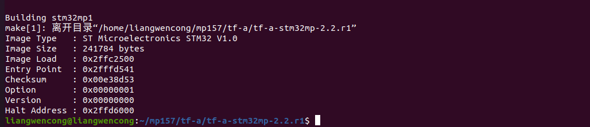
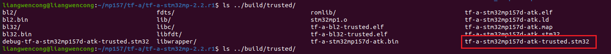
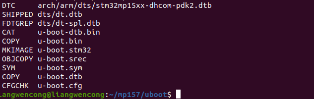
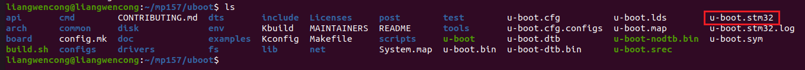
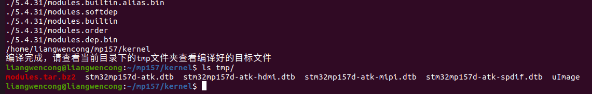

# 6.3 Qt应用程序的交叉编译工具链

## 6.3.1 编译TF-A

&emsp;&emsp;将`开发板光盘->1、程序源码1、正点原子 Linux 出厂系统源码->tf-a-stm32mp-2.2.r1-gxxxxxxx-vx.x.tar.bz2`（x 代表未版本，可能为.xz 格式或者.bz2 格式）TF-A源码拷贝到ubuntu的家目录下，使用以下命令去编译TF-A(`要确保安装了Qt应用程序的交叉编译工具链`)：

```c#
mkdir mp157/tf-a -p
tar -axvf tf-a-stm32mp-2.2.r1-g212d381-v1.4.tar.bz2 -C mp157/tf-a/
cd mp157/tf-a/tf-a-stm32mp-2.2.r1/
```

&emsp;&emsp;使用ls命令可以查看TF-A的源码目录文件。在TF-A的源码里写了一个脚本，脚本里已经有编译命令。可以直接执行build.sh文件，即可编译TF-A源码。编译好的TF-A文件是tf-a-stm32mp157d-atk-trusted.stm32，运行命令如下所示：

```c#
./build.sh //开始编译TF-A
```

&emsp;&emsp;编译成功会有如下打印信息：


<center>
<br />
图6.3.1 编译TF-A的打印信息
</center>

&emsp;&emsp;编译成功在源码目录下的“../build/trusted”目录下生成stm32mp157d-atk-trusted.stm32文件，如下图所示：


<center>
<br />
图6.3.1.2 查看stm32mp157d-atk-trusted.stm32文件生成
</center>

## 6.3.2 编译U-Boot

&emsp;&emsp;将`开发板光盘->1、程序源码->1、正点原子 Linux 出厂系统源码-> u-boot-stm32mp-2020.01-gxxxxxxx-vxx.tar.bz2`（x 代表未版本，可能为.xz 格式或者.bz2 格式）把UBOOT源码拷贝到ubuntu的家目录里，使用以下命令去编译UBOOT(要确保安装了Qt应用程序的交叉编译工具链)：

```c#
mkdir mp157/uboot -p
tar -axvf u-boot-stm32mp-2020.01-g00f14581-v1.4.tar.bz2 -C mp157/uboot/
cd mp157/uboot/
```

&emsp;&emsp;使用ls命令可以查看UBOOT的源码目录文件。在UBOOT的源码里写了一个脚本，脚本里已经有编译命令。可以直接执行build.sh文件，即可编译UBOOT源码。编译好的UBOOT文件是u-boot.stm32，运行命令如下所示：

```c#
./build.sh //开始编译uboot
```

&emsp;&emsp;编译成功会有如下打印信息：

<center>
<br />
图6.3.2.1 uboot编译的打印信息
</center>

&emsp;&emsp;编译成功在源码目录下生成u-boot.stm32文件，如下图所示：

<center>
<br />
图6.3.2.2 查看u-boot.stm32文件
</center>

## 6.3.3 编译内核

&emsp;&emsp;将`开发板光盘->1、程序源码->1、正点原子 Linux 出厂系统源码-> linux-5.4.31-gxxxxxxxx-vxx.tar.bz2`（x 代表未版本，可能为.xz 格式或者.bz2 格式）把内核源码拷贝到ubuntu的家目录里，使用以下命令去编译内核(要确保安装了Qt应用程序的交叉编译工具链)：

```c#
mkdir mp157/kernel
tar -axvf linux-5.4.31-gdf7f741ec-v1.5.tar.bz2 -C mp157/kernel/
cd mp157/kernel/
```

&emsp;&emsp;使用ls命令可以查看内核的源码目录文件。在内核的源码里写了一个脚本，脚本里已经有编译命令。可以直接执行build.sh文件，即可编译内核源码。运行命令如下所示：

```c#
./build.sh //开始编译内核源码，同时编译uImage、设备树和模块
```

&emsp;&emsp;编译完成，及查看 tmp 目录下的编译目标文件，如下图，包含很多 dtb 文件（设备树），及 Linux 内核 uImage，还有 modules.tar.bz2（内核模块）,如下图所示：

<center>
<br />
图6.3.3.1 查看编译生成后的文件
</center>

&emsp;&emsp;至此，快速体验文档已经结束，希望对大家有所帮助！

## 附录A

&emsp;&emsp;STM32MP1源码更新表格说明：

&emsp;&emsp;出厂内核历史版本

| 版本 | Linux的Git版本 | 历史记录                                                     | 日期 |
| ---- | -------------- | ------------------------------------------------------------ | ---- |
| V1.0 | fc6a805bb      | 无                                                           |      |
| V1.0 | b559c33a3      | 1.添加了4G模块ME3630                                         |      |
| V1.0 | f08d654e1      | 1.实现CPU动态调频                                            |      |
| V1.0 | 8ec8da074      | 1.添加了SPDIF的设备树                                        |      |
| V1.1 | 265df13e0      | 1.修复了背光PWM功能                                          |      |
| V1.2 | cadb9cbd0      | 1.添加了鼠标mice设备。2.添加6.4.3的GPU驱动。3.添加NFS-SERVER的支持。4.修改了触摸支持wayland，删除tslib。5.解决触摸上传格式。 |      |
| V1.3 | dd2b8a693      | 1.禁用SUB OTG的电源管理。2.添加fusb302驱动，兼容旧的OTG驱动。3.修复SPIDF的USB OTG。4.删除了Uboot选择触摸IC。 |      |

