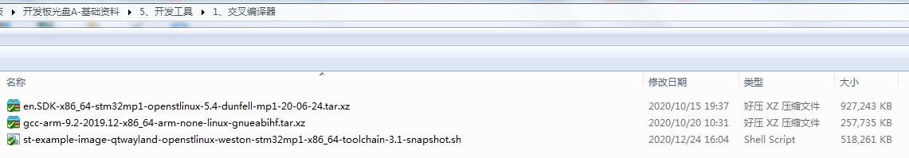

# 6 ATK-STM32MP157交叉编译篇

&emsp;&emsp;正点原子提供了三个交叉编译工具链，常用的是gcc-arm-9.2-2019.12-x86_64-arm-none-linux-gnueabihf这个工具链，用于【正点原子】STM32MP1嵌入式Linux驱动开发指南教学用。下面是这三个交叉编译工具链的介绍。

&emsp;&emsp;在网盘路径**STM32MP157开发板->开发板光盘A-基础资料->5、开发工具->1、交叉编译器**路径下可以看到如下三个交叉编译器，如下图解释。

 
图6 1 提供的三种交叉编译工具链

&emsp;&emsp;解释： 
&emsp;&emsp;1.	en.SDK-x86_64-stm32mp1-openstlinux-5.4-dunfell-mp1-20-06-24.tar.xz是ST官方交叉编译工具链。 
&emsp;&emsp;2.	gcc-arm-9.2-2019.12-x86_64-arm-none-linux-gnueabihf.tar.xz是通用官方ARM交叉编译工具，ST推荐使用。 
&emsp;&emsp;3.	st-example-image-qtwayland-openstlinux-weston-stm32mp1-x86_64-toolchain-3.1-snapshot.sh由ST的Yocto项目，经过定制修改编译出，已经裁剪过，节约用户硬盘的空间。被封装成脚本形式，在Ubuntu下直接执行安装，我们常用来编译Linux与构建Qt应用程序。

