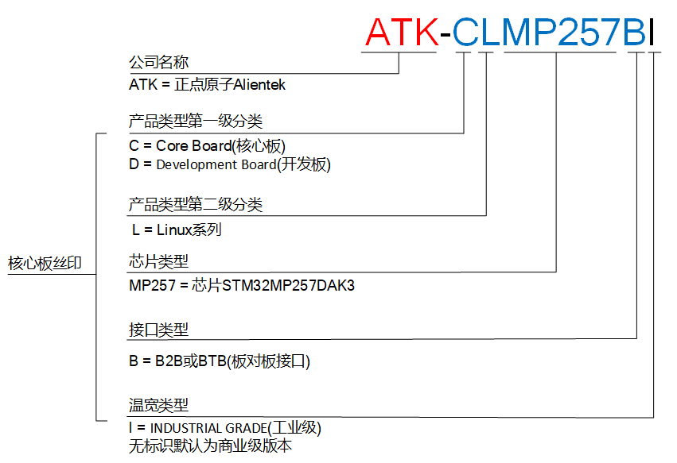

# 2.1 产品命名

 
图 2 产品命名

# 2.2 商业级和工业级的区别

&emsp;&emsp;ATK-CLMP257B 系列核心板根据使用场景工作温度不同，分为商业级版本和工业级版本。 

&emsp;&emsp;商业级核心板工作温度为0℃ ~ +70℃

&emsp;&emsp;工业级核心板工作温度为-40℃ ~ +85℃

&emsp;&emsp;商业级 BTB 版本核心板丝印命名为 ATK-CLMP257B，工业级 BTB 版本核心板丝印命名为ATK-CLMP257BI。

&emsp;&emsp;如无特殊说明，本文档图片为商业级核心板。

