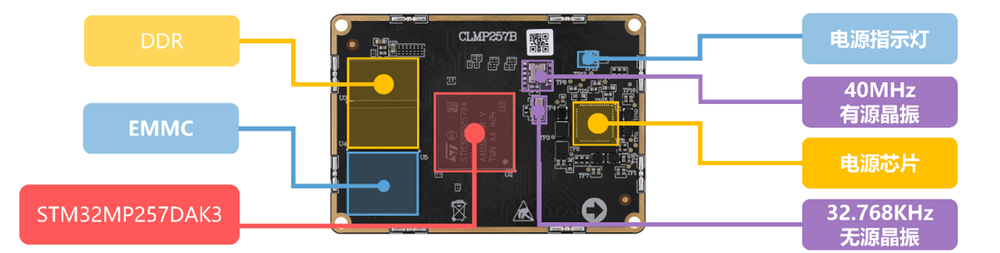

# 3.2 核心板资源

&emsp;&emsp;ATK-CLMP257B核心板主要集成了STM32MP257DAK3处理器（包括双核 Cortex-A35、Cortex-M33 和 Cortex-M0+），搭载DDR4内存和eMMC存储，为系统提供高效的数据处理和存储能力。核心板配备了高效能的PMIC电源管理芯片STPMIC25D，满足多核系统的电源需求而设计。

 
图 3 CLMP257B核心板正面资源

 
图 4 CLMP257B核心板背面资源

