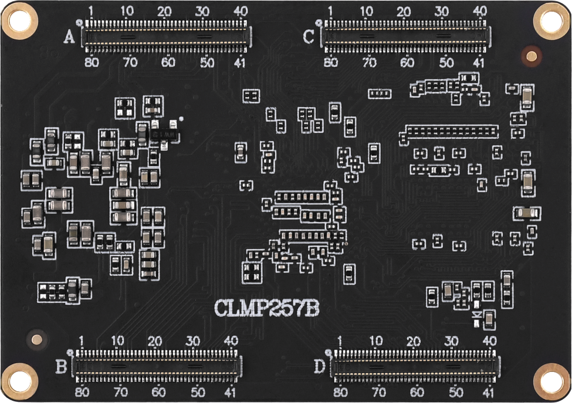
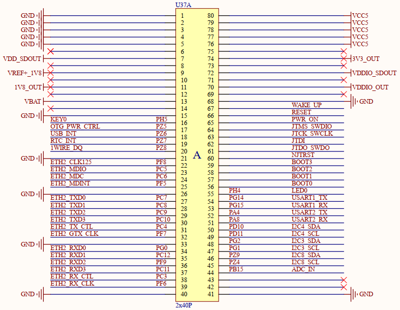
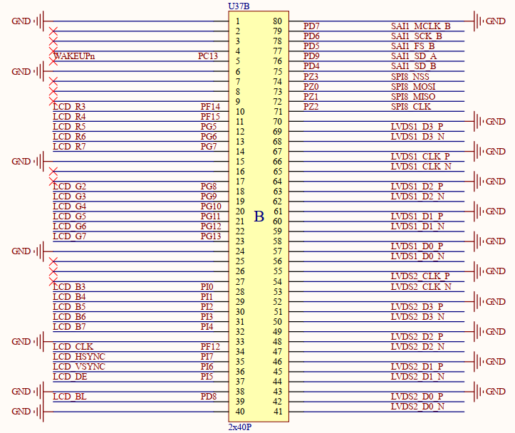
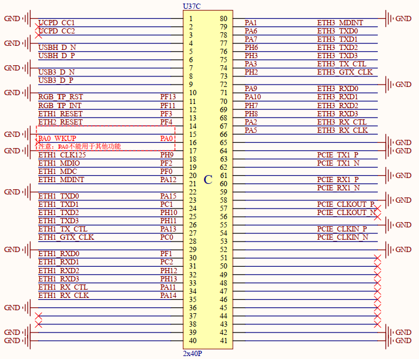
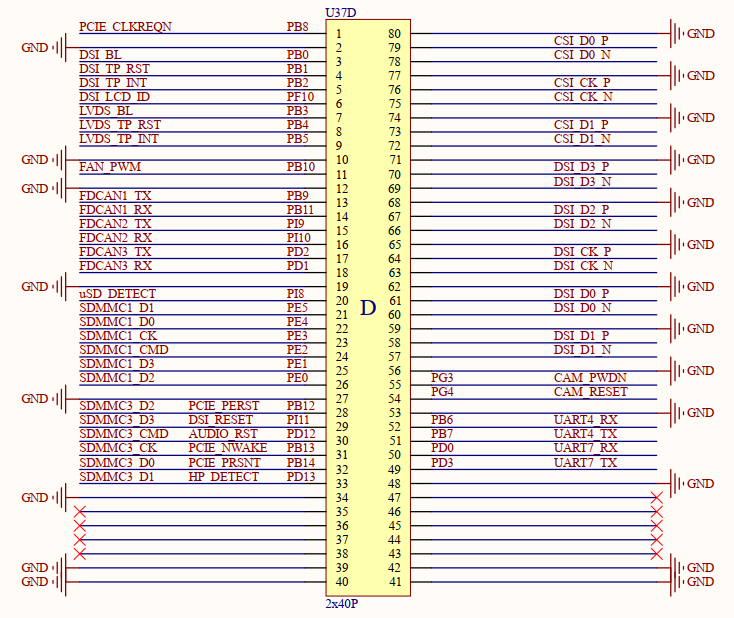

# 3.3 管脚顺序及接口信号

&emsp;&emsp;在ATK-CLMP257B 核心板的 PINOUT 部分就是核心板 BTB 连接器对应的管脚定义，此连接器是4个2*40PIN的规格，一共有320个管脚。 

&emsp;&emsp;核心板背面有管脚序号丝印，如下所示：

 
图 5 核心板背面

&emsp;&emsp;可以看到核心板背面上有两对BTB连接器公座，上面的是A、C，下面的是B、D分别标有1、40、41、80管脚号，和底板上的BTB母座管脚号一一对应。

&emsp;&emsp;具体管脚功能定义，可以查看ATK-DLMP257B底板原理图的。

 
图 6 底板原理图管脚定义部分

&emsp;&emsp;这里只写了核心板在底板上使用的功能（也就是默认出厂系统功能），如果想要查看管脚其它可复用功能，请查看文档《【正点原子】ATK-CLMP257B核心板接口数据手册.xlsx》。
