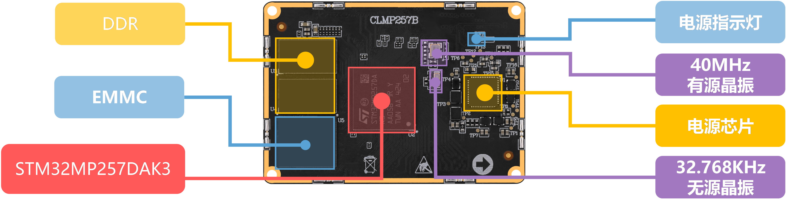

# 1.2 ATK-CLMP257B核心板资源

&emsp;&emsp;下面我们来看ATK-CLMP257B核心板资源，如下图所示。

 
图1.2 ATK-CLMP257B核心板资源

&emsp;&emsp;整个核心板的外形尺寸为60mm*42mm大小，非常小巧，采用了0.4mm间距贴片板对板连接器，与底板BTB连接座的合高为1.5mm，可以很方便地应用在各种项目上。

&emsp;&emsp;正点原子ATK-CLMP257B核心板板载资源如下：

&emsp;&emsp;◆	CPU：处理器STM32MP257DAK3，双核Cortex-A35(主频1.5GHz)，单核Cortex-M33（400MHz），VFBGA424封装，14x14mm 
&emsp;&emsp;◆	GPU：900MHz 
&emsp;&emsp;◆	NPU：900MHz，1.35TOPS 
&emsp;&emsp;◆	内存DDR4：容量为1GB\2GB 
&emsp;&emsp;◆	存储EMMC：容量为8GB\16GB 
&emsp;&emsp;◆	高稳定性电源管理PMIC：STPMIC25 
&emsp;&emsp;◆	四个2*40P BTB连接座，共计320PIN

&emsp;&emsp;正点原子ATK-CLMP257B核心板的特点包括：

&emsp;&emsp;1)、体积小巧。核心板仅60mm*42mm大小，方便使用到各种项目。 
&emsp;&emsp;2)、集成方便。核心板使用4个2*40P BTB连接座，可以非常方便地集成到客户PCB上，更换简单，方便维修测试。 
&emsp;&emsp;3)、资源丰富。核心板板载不同容量DDR4内存、EMMC存储器，可以满足多种应用需求。 
&emsp;&emsp;4)、性能稳定。核心板采用10层板设计，单独地层、电源层，所有关键信号采用等长线走线，元器件布局合理；另采用ST针对STM32MP2x MPU系列应用专门设计的低功耗、高效率电源管理芯片PMIC进行稳定供电，保证核心板长期运行稳定、可靠。 
&emsp;&emsp;5)、人性化设计。按功能分区引出IO口，方便布线。 
&emsp;&emsp;6)、防反插设计。BTB连接座位置错开，BTB连接座防反插设计。

