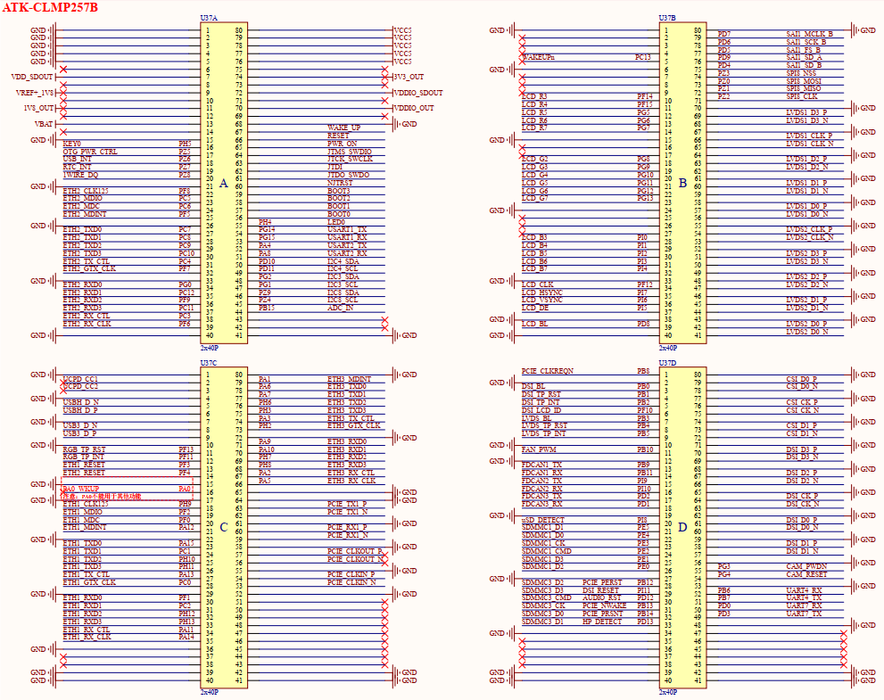
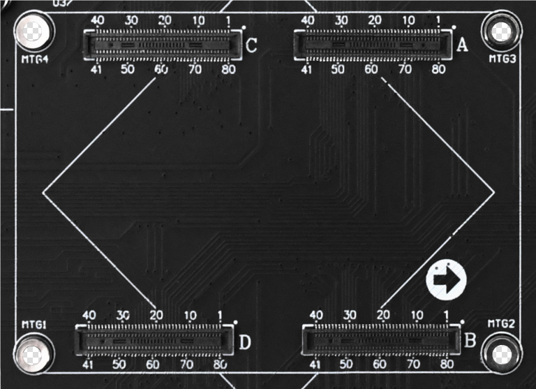

&emsp;&emsp;本节将对ATK-DLMP257B开发板底板各部分电路进行分解讲解，描述各部分电路功能常规设计及可能存在的注意事项，供产品硬件设计参考。开发板硬件电路可能会根据需要而进行更新优化、版本迭代，如用户参考本电路进行产品项目开发，需评估是否符合项目需求，进行电路优化、防护等。

# 3.1 核心板对接接口定义

&emsp;&emsp;开发板底板采用4个2*40P、0.4mm间距的贴片板对板连接器来与核心板连接，插拔非常方便。底板上面的核心板对接接口引脚定义如下图所示（具体引脚定义可查看《ATK-CLMP257B核心板接口数据手册》）。

 
图3.1.1 底板对接核心板连接座引脚定义

 
图3.1.2 底板对接核心板连接座引脚定义

&emsp;&emsp;图中有4个连接座，分别为A、B、C、D序号，此序号对应核心板连接座A、B、C、D序号，不能随机调换序号位置，须一一对应，即A-A、B-B、C-C、D-D，才能和核心板对接正确。该4个连接座包含193个处理器引脚，1个核心板电源管理芯片休眠唤醒引脚WAKE_UP，72个GND引脚，12个电源相关引脚，42个空置引脚，共计组成连接320PIN。

