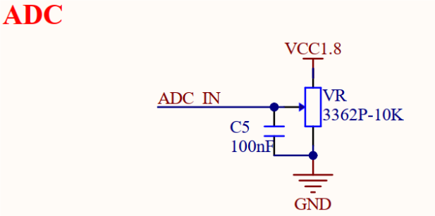
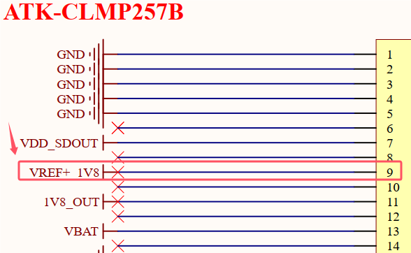

# 3.10 可调电位器（ADC电压采集）

&emsp;&emsp;开发板板载一个可调电位器，原理图如下图所示。

 
图3.10.1 可调电位器

&emsp;&emsp;该可调电位器相当于一个滑动变阻器，阻值为10K，可通过调整阻值，实现不同电压配置。

&emsp;&emsp;注意，根据STM32MP257处理器手册要求，ADC引脚最大采集电压不能超过1.8V。另外在BTB连接座接口定义中，预留了外置ADC VREF+参考电压引脚，由于该ADC参考电压已在核心板上默认连接1.8V，故该外置参考电压引脚不用重复连接1.8V，保持空置。

 
图3.10.2 ADC VREF+参考电压引脚

