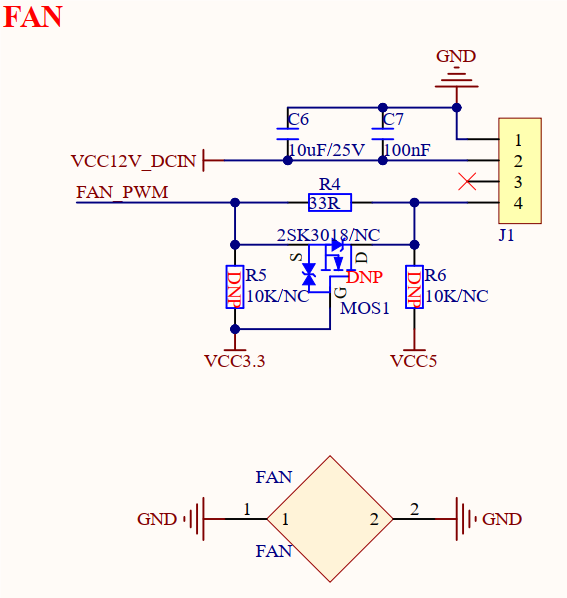

# 3.11 风扇接口

&emsp;&emsp;开发板板载一个风扇接口，原理图如下图所示。

 
图3.11 风扇接口

&emsp;&emsp;图中J1端子是4PIN的风扇接口，可以连接正点原子散热风扇，该风扇带有PWM调速接口，用户可通过软件程序自定义实现动态调速。核心板在常规工作条件下，不必要外接散热风扇，若用户产品有特殊散热要求，本电路仅提供参考，接入小功率散热风扇，将风扇底部平面通过散热材料（比如硅脂）接触核心板处理器、DDR、EMMC、PMIC等发热器件，进行散热。除了小功率风扇散热，也可通过散热片进行散热等。具体散热措施需根据产品需求进行整体设计。

