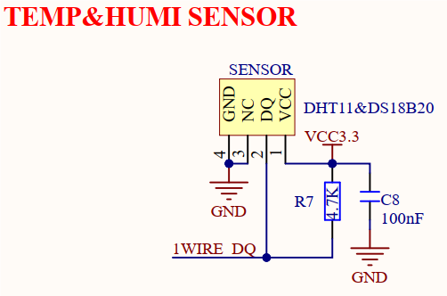

# 3.12 温湿度传感器接口

&emsp;&emsp;开发板板载一个温湿度传感器接口，原理图如下图所示。

 
图3.12 温湿度传感器接口

&emsp;&emsp;该接口为单总线通信，实际上就是一个普通GPIO，通过高低电平的时序控制，来实现外部传感器模块的数据读取，该接口适配支持正点原子DHT11温湿度传感器和DS18B20温度传感器。只要引脚定义一致，其他传感器也可以接入该接口进行调试、测试使用。

