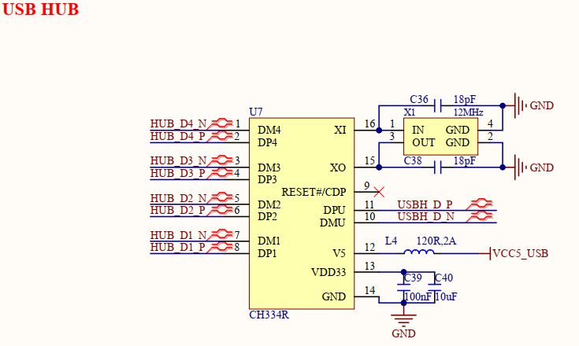

# 3.14 USB HOST接口

&emsp;&emsp;开发板板载2路USB HOST接口，为USB Type-A连接座，原理图如下图所示：

 
图3.14.1 USB HUB电路

 
图3.14.2 USB HOST接口

&emsp;&emsp;开发板采用USB HUB扩展电路，使用CH334R USB扩展芯片对核心板STM32MP257处理器USBH总线接口进行扩展，实现1路扩4路USB HOST接口功能。其中HUB_D3和HUB_D4为外置USB HOST接口，分别对应USB_HOST1、USB_HOST2两个端口，可接入U盘、键盘、鼠标、USB摄像头等设备；而HUB_D2用于连接4G/5G RedCap无线模块，HUB_D1用于连接WIFI&蓝牙模组。该电路添加静电防护器件，提升电路可靠性。

