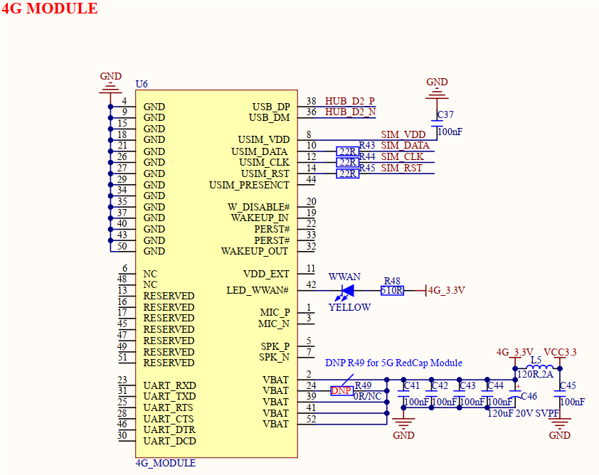
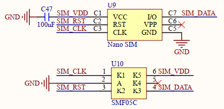

# 3.15 Mini PCIE接口

&emsp;&emsp;开发板板载一个Mini PCIE接口，52PIN连接座，原理图如下图所示。

 
图3.15.1 Mini PCIE接口

 
图3.15.2 Nano SIM卡接口

&emsp;&emsp;该Mini PCIE接口实质上是使用USB总线，通过HUB_D2信号线连接到板载USB HUB芯片上。此接口可以连接4G或5G RedCap无线模组，比如高新兴物联ME3630 4G模组、移远EC20 4G模组、广和通5G RedCap FG132模组等。4G\5G无线模组需要插入SIM卡进行联网使用。此处补充说明，对于5G RedCap模组，开发板目前仅适配广和通5G RedCap FG132模组，若用户使用其他品牌模组，需检查该接口是否硬件兼容。该电路添加静电防护器件，提升电路可靠性。

