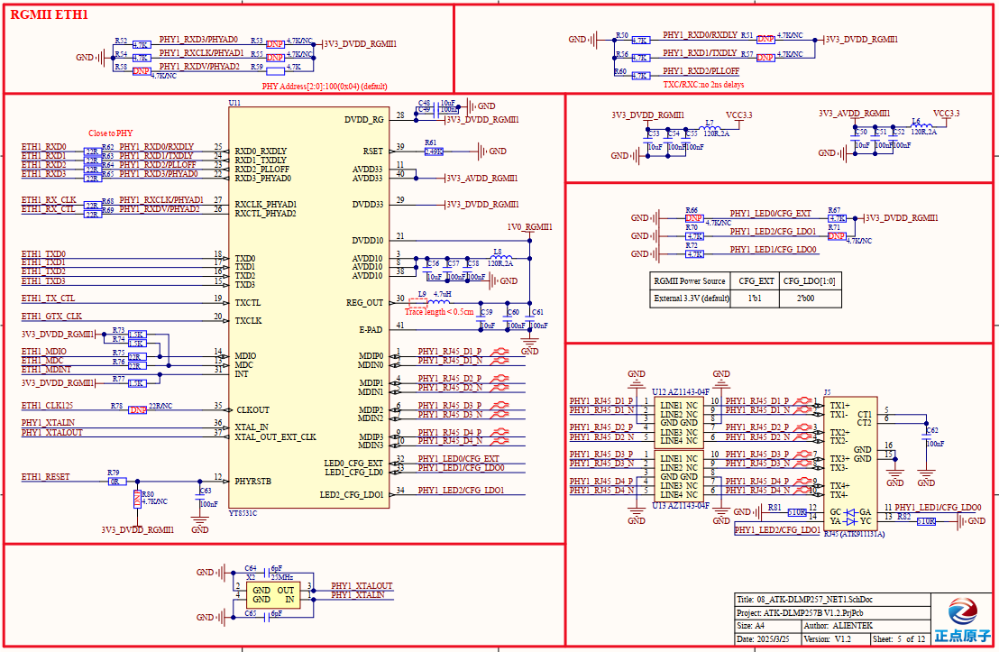
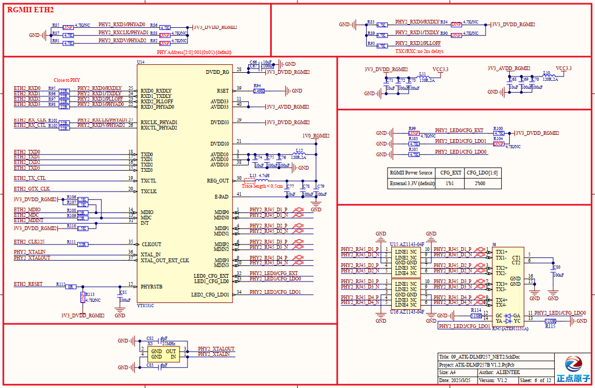
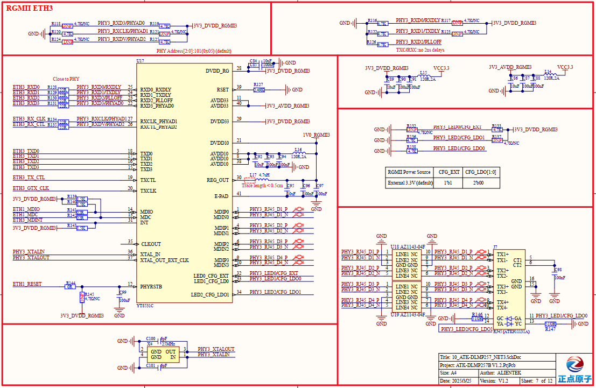

# 3.16 千兆以太网接口 

&emsp;&emsp;开发板板载3路千兆以太网接口，原理图如下图所示。

 
图3.16.1 千兆以太网接口ETH1

 
图3.16.2 千兆以太网接口ETH2

 
图3.16.3 千兆以太网接口ETH3

&emsp;&emsp;开发板使用裕太微电子YT8531C网络PHY芯片实现3路千兆以太网接口，均支持10M/100M/1000M自适应速率。RJ45连接座选用型号为HR911131A，内置网络变压器，自带有2个指示灯，分别为黄色指示灯和绿色指示灯。该3路千兆以太网接口电路，在设计思路上大体保持一致。按电路功能分解，YT8531C应用电路可划分为3个部分，分别为数据通信部分、电气配置部分及电源供电部分。

&emsp;&emsp;数据通信部分，涉及YT8531C芯片数据收发引脚，为RXD0~RXD3、RXCLK、RXCTL、TXD0~TXD3、TXCLK、TXCTL、MDIO、MDC等引脚。核心板STM32MP257处理器通过这些引脚对外进行网络数据收发及PHY芯片参数配置。

&emsp;&emsp;电气配置部分，配置电气属性的引脚与部分数据通信引脚共用，上电时通过对这些引脚高低电平的配置，来实现指定电气属性，比如配置PHY硬件地址、配置TXCLK\RXCLK时钟延迟周期、配置YT8531C供电电平。如ETH3以太网接口电路中，配置PHY硬件地址为5，取消配置TXCLK/RXCLK时钟延迟2ns，及配置采用RGMII总线外部供电电源3.3V。

&emsp;&emsp;电源供电部分，由于核心板STM32MP257处理器千兆以太网RGMII引脚是3.3V电平信号，故该电路配置采用RGMII总线外部供电电源3.3V，对YT8531C芯片供电3.3V即可，同时做好电源滤波。

&emsp;&emsp;建议采用四层线路板设计千兆网络，否则两层线路板未能保持完整参考平面，可能导致网络速度未能达到近千兆速率。该电路中添加静电防护器件，提升电路可靠性。

