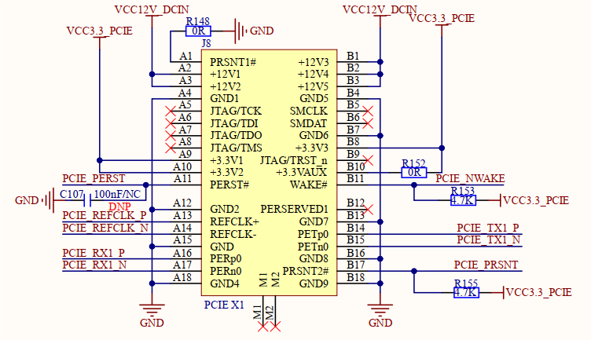
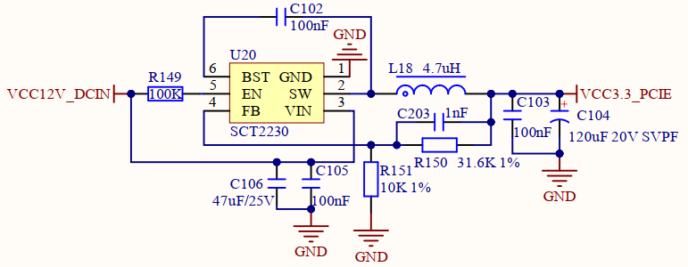
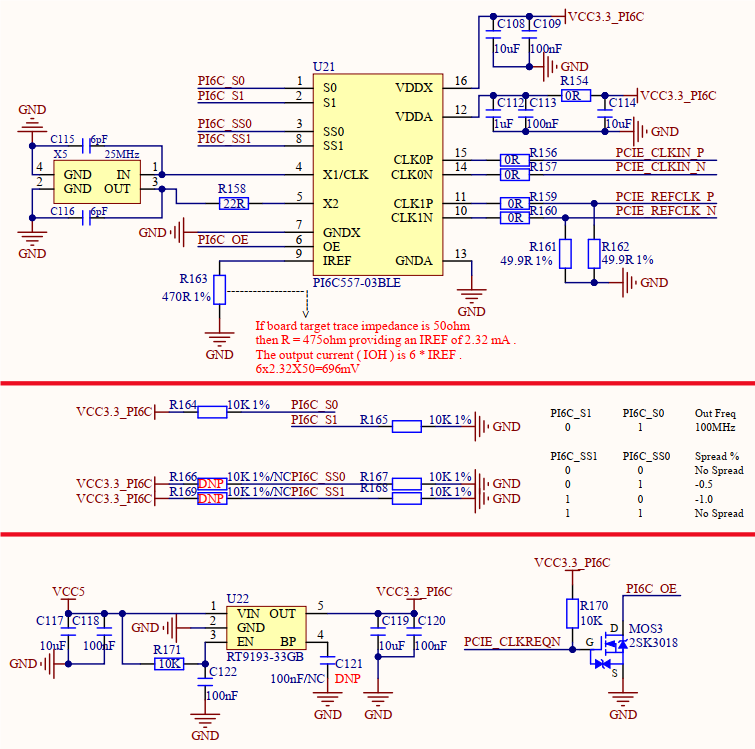
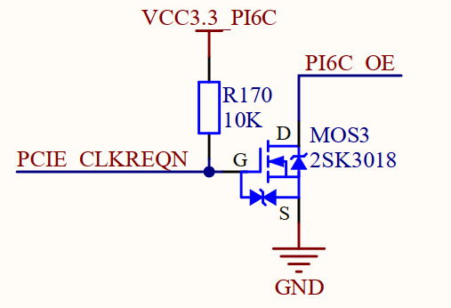

# 3.17 PCIE接口

&emsp;&emsp;开发板板载1路PCIE接口，原理图如下图所示。

 
图3.17.1 PCIE接口

&emsp;&emsp;该接口支持PCIE2.0版本协议，采用36PIN连接座。可接入PCIE接口设备，比如PCIE接口WIFI模块、PCIE接口硬盘、PCIE接口千兆以太网模块等。

&emsp;&emsp;该接口中，使用直流12V和3.3V对外部设备进行独立供电。
 

 
图3.17.2 PCIE接口3.3V供电

&emsp;&emsp;下图中U21 PI6C557-03BLE芯片是扩频时钟发生器芯片，通过外部25MHz晶振产生2路100MHz时钟，同时提供给外部设备和核心板STM32MP257处理器作为PCIE时钟源。

 
图3.17.3 PCIE扩频时钟电路

&emsp;&emsp;注意PI6C557-03BLE芯片的OE使能引脚，当系统软件初始化PCIE外设时，会自动拉低PCIE_CLKREQN引脚电平，此时通过底板NMOS电路将PI6C_OE信号断开与GND连接，此时PI6C_OE引脚为高电平，从而使能PI6C557-03BLE扩展时钟芯片，对外部提供PCIE时钟源。若时钟芯片没有使能，未能提供PCIE时钟源，则系统软件将不能正常初始化PCIE外设。建议用户参考本电路。

 
图3.17.4 PCIE扩频时钟芯片使能控制电路

