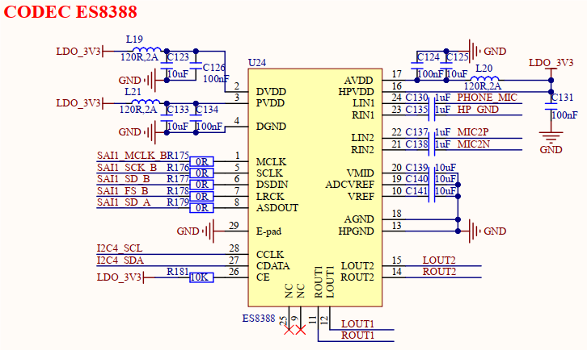
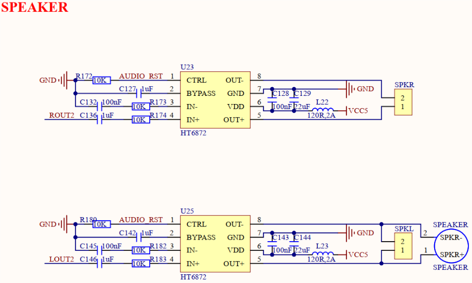
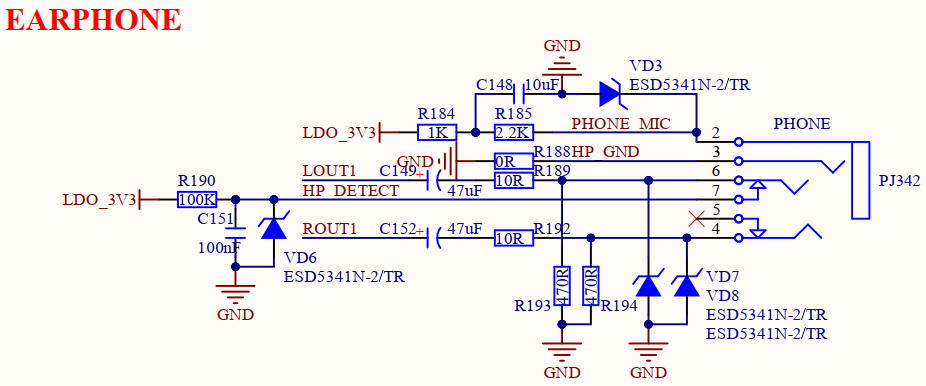
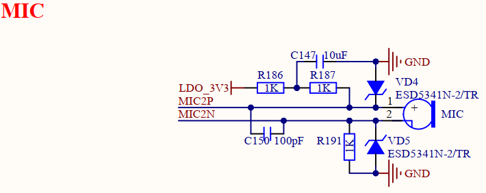
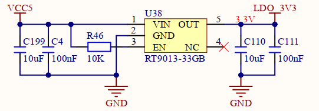

# 3.18 音频接口

&emsp;&emsp;开发板板载一个高性能音频编解码芯片ES8388，实现音频播放和音频录制功能，原理图如下图所示。

 
图3.18.1 ES8388音频电路

&emsp;&emsp;ES8388是一款高性能、低功耗、低成本的立体声音频编解码器，该芯片内部集成了 24位高性能ADC和DAC，由双通道ADC、双通道DAC、麦克风放大器、耳机放大器、数字音效以及模拟混音和增益功能组成，支持8KHZ~96KHz采样率，可通过I2C接口进行配置。

&emsp;&emsp;开发板板载音频接口对外引出2路扬声器接口、1路耳机接口和1个板载麦克风接口。

 
图3.18.2外置功放扬声器电路

 
图3.18.3耳机放音及录音电路

 
图3.18.4板载麦克风录音电路

 
图3.18.5音频供电电路

&emsp;&emsp;ES8388音频芯片内部没有功放功能，故需要外置功放芯片才能进行扬声器放音。开发板采用HT6872单声道D类音频功率放大器，来驱动外部扬声器。开发板板载一个8Ω1W扬声器（在背面），通过功放芯片HT6872连接到ES8388的LOUT2通道，提供给用户进行音频测试，同时还对外提供SPKR及SPKL两个扬声器连接端子（XH2.54标准接口），方便用户进行扬声器拓展连接。

&emsp;&emsp;除了扬声器可以放音，开发板还支持耳机放音，耳机电路如图3.18.3所示。当ES8388播放音频时，在不插入耳机情况下，开发板自动从外置扬声器进行播放；当插入耳机时，会自动切换到耳机播放，此时扬声器自动停止播放。该设计符合用户常规使用体验。开发板板载耳机接口PHONE采用一个四段式3.5mm耳机接口PJ342，支持放音、录音及热插拔检测。用户在设计此接口时，需注意所选用耳机座物料规格是否支持4段式，也可以按项目需要进行设计。

&emsp;&emsp;录音有两种选择，一种是耳机自带的MIC，一种是开发板板载的驻极体麦克风，同一时
刻只能二选一。驻极体麦克风录音电路如图3.18.4所示。

&emsp;&emsp;该音频电路采用独立供电，通过低噪声、低压差LDO电源芯片提供电源3.3V，能够有效降低整板高负载使用时的音频电路噪声。

